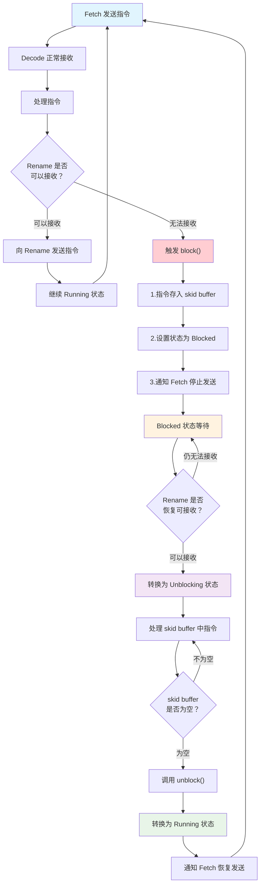

# GEM5 O3 CPU Decode Stage 详细解析文档

## 概述

Decode 阶段是 GEM5 O3 处理器模型中的第二个流水线阶段，位于 Fetch 和 Rename 之间。虽然指令的实际解码工作在 Fetch 阶段创建 StaticInst 时已经完成，但 Decode 阶段的主要职责是进行**分支预测验证（Branch Prediction Check）**，确保从 Fetch 阶段传来的分支预测信息是正确的。

## 核心功能

### 主要职责
1. **分支预测验证**: 检查 Fetch 阶段的分支预测是否正确
2. **指令流控制**: 在检测到错误预测时发送 squash 信号给 Fetch 阶段
3. **流水线控制**: 处理来自后续阶段的阻塞和 squash 信号
4. **指令传递**: 将经过验证的指令传递给 Rename 阶段
5. **停顿传播**: 在流水线阶段间传播停顿原因

### 核心验证机制（Precheck）
Decode 阶段实现了四种关键的分支预测验证：

1. **控制流预测验证**: 检查被预测为跳转的指令是否真的是控制指令
2. **直接分支目标验证**: 对于直接分支，计算实际目标并与预测目标比较
3. **未预测返回指令处理**: 处理被 BP 遗漏的返回指令
4. **非推测指令修正**: 修正错误预测的非推测指令

## 核心数据结构

### 1. 流水线状态管理

#### 整体状态
```cpp
enum DecodeStatus {
    Active,      // 有线程在活跃处理
    Inactive     // 所有线程都空闲
} _status;
```

#### 线程级状态
```cpp
enum ThreadStatus {
    Running,      // 正常运行，处理指令
    Idle,         // 空闲，没有指令处理
    StartSquash,  // 开始 squash 操作
    Squashing,    // 正在进行 squash
    Blocked,      // 被下游阶段阻塞
    Unblocking    // 正在解除阻塞
} decodeStatus[MaxThreads];
```

### 2. 时间缓冲接口系统

#### 输入接口（接收信号）
```cpp
// 来自 Fetch 阶段的指令队列
TimeBuffer<FetchStruct>::wire fromFetch;
// 包含: insts[]数组、size、fetchStallReason[]

// 来自 Rename 阶段的反向控制信号  
TimeBuffer<TimeStruct>::wire fromRename;
// 包含: renameBlock[]、renameUnblock[]、renameInfo.blockReason

// 来自 IEW 阶段的信号
TimeBuffer<TimeStruct>::wire fromIEW;

// 来自 Commit 阶段的重要控制信号
TimeBuffer<TimeStruct>::wire fromCommit;
// 包含: commitInfo[].squash、squashVersion、squashInst等
```

#### 输出接口（发送信号）
```cpp
// 向 Fetch 阶段发送控制信息
TimeBuffer<TimeStruct>::wire toFetch;
// 包含: decodeInfo[].squash、branchMispredict、nextPC等

// 向 Rename 阶段传递指令
TimeBuffer<DecodeStruct>::wire toRename; 
// 包含: insts[]数组、size、fetchStallReason、decodeStallReason
```

### 3. 指令缓冲和队列管理

#### 指令队列
```cpp
// 每线程的指令队列：存储从 Fetch 来的新指令
std::queue<DynInstPtr> insts[MaxThreads];

// 滑动缓冲区：当阶段被阻塞时临时存储指令
std::queue<DynInstPtr> skidBuffer[MaxThreads];
unsigned skidBufferMax;  // 最大缓冲区大小

// 当前周期向 Rename 发送的指令索引
unsigned toRenameIndex;
```

### 4. 停顿和阻塞控制

#### 停顿跟踪结构
```cpp
struct Stalls {
    bool rename;  // 来自 Rename 阶段的停顿信号
} stalls[MaxThreads];

// 停顿原因向量：记录每个指令槽的停顿原因
std::vector<StallReason> decodeStalls;  // 大小 = decodeWidth

// 当前阻塞的原因
StallReason blockReason;
```

#### 停顿原因类型
```cpp
enum StallReason {
    NoStall,         // 无停顿
    InstSquashed,    // 指令被 squash
    InstMisPred,     // 分支误预测
    SquashStall,     // 正在 squash 过程中
    FetchFragStall,  // Fetch 阶段片段停顿
    // ... 其他停顿类型
};
```

### 5. 性能统计结构

```cpp
struct DecodeStats {
    statistics::Scalar idleCycles;        // 空闲周期数
    statistics::Scalar blockedCycles;     // 阻塞周期数  
    statistics::Scalar runCycles;         // 运行周期数
    statistics::Scalar unblockCycles;     // 解除阻塞周期数
    statistics::Scalar squashCycles;      // Squash 周期数
    
    statistics::Scalar branchResolved;    // 分支解析次数
    statistics::Scalar branchMispred;     // 分支误预测次数
    statistics::Scalar controlMispred;    // 控制误预测次数
    
    statistics::Scalar decodedInsts;      // 解码指令总数
    statistics::Scalar squashedInsts;     // 被 squash 的指令数
    
    statistics::Scalar mispredictedByPC;  // PC 误预测数量
    statistics::Scalar mispredictedByNPC; // NPC 误预测数量
} stats;
```

### 6. 版本控制和延迟处理

```cpp
// Squash 版本控制（用于乱序处理）
SquashVersion localSquashVer;

// MIPS 特有的延迟分支处理
Addr bdelayDoneSeqNum[MaxThreads];           // 延迟槽完成序号
DynInstPtr squashInst[MaxThreads];           // Squash 指令指针  
bool squashAfterDelaySlot[MaxThreads];       // 延迟槽后 squash 标志
// 之后可以删除了，目前只支持RISCV了
```

#### 版本控制机制详解

Decode 阶段使用 **version-based squash strategy** 来处理多重 squash 冲突：

```cpp
// 在 sortInsts() 中进行版本检查
void Decode::sortInsts() {
    int insts_from_fetch = fromFetch->size;
    for (int i = 0; i < insts_from_fetch; ++i) {
        const DynInstPtr &inst = fromFetch->insts[i];
        
        // 检查指令版本是否过期
        if (localSquashVer.largerThan(inst->getVersion())) {
            inst->setSquashed();  // 标记过期指令
        }
        
        insts[inst->threadNumber].push(inst);
    }
}

// 在接收 Commit squash 时同步版本
if (fromCommit->commitInfo[tid].squash) {
    squash(tid);
    
    // 同步版本号，确保后续指令使用新版本
    localSquashVer.update(fromCommit->commitInfo[tid].squashVersion.getVersion());
    DPRINTF(Decode, "Updating squash version to %u\n", localSquashVer.getVersion());
    
    return true;
}
```

**版本控制的作用**：
- **时期分离**: 区分不同 squash epoch 的指令
- **精确清理**: 只处理属于过期版本的指令
- **冲突解决**: 处理 Decode 和 Commit 同时发送 squash 的情况

## 核心函数详细解析

### 1. tick() - 主时钟周期函数

```cpp
void Decode::tick()
```

**功能**: 每个时钟周期的主处理函数，协调整个 Decode 阶段的工作流程。

**执行流程**:

#### 1.1 初始化阶段
```cpp
// 传递 Fetch 的停顿原因给 Rename
toRename->fetchStallReason = fromFetch->fetchStallReason;

// 重置周期状态
wroteToTimeBuffer = false;
bool status_change = false;
toRenameIndex = 0;
```

#### 1.2 指令预处理
```cpp
sortInsts();  // 将 Fetch 来的指令按线程分类
```

#### 1.3 多线程处理循环
```cpp
while (threads != end) {
    ThreadID tid = *threads++;
    
    // 检查并更新信号状态
    status_change = checkSignalsAndUpdate(tid) || status_change;
    
    // 执行实际的解码处理
    decode(status_change, tid);
    
    // 设置反馈给 Fetch 的阻塞原因
    toFetch->decodeInfo[tid].blockReason = blockReason;
}
```

#### 1.4 停顿原因传播逻辑
```cpp
if (stalls[tid].rename) {
    // 有来自 Rename 的停顿 -> 传播 Rename 停顿
    setAllStalls(fromRename->renameInfo[tid].blockReason);
} else if (toRenameIndex == 0) {
    // 本周期没有处理任何指令 -> 传播 Decode 自身的停顿
    if (decodeStalls[0] != StallReason::NoStall) {
        setAllStalls(decodeStalls[0]);
    }
} else {
    // 处理了部分指令 -> 分别设置处理和未处理指令的停顿状态
    for (int i = 0; i < decodeStalls.size(); i++) {
        if (i < toRenameIndex) {
            decodeStalls.at(i) = StallReason::NoStall;  // 已处理：无停顿
        } else {
            decodeStalls.at(i) = fromFetch->fetchStallReason.at(i);  // 未处理：传播 Fetch 停顿
        }
    }
}

// 将停顿原因传递给 Rename 阶段
toRename->decodeStallReason = decodeStalls;
```

### 2. checkSignalsAndUpdate() - 信号检查和状态更新

```cpp
bool checkSignalsAndUpdate(ThreadID tid)
```

**功能**: 检查来自其他流水线阶段的控制信号，并相应更新 Decode 状态。

**处理优先级**:

#### 2.1 Commit 阶段 Squash 信号（最高优先级）
```cpp
if (fromCommit->commitInfo[tid].squash) {
    DPRINTF(Decode, "[tid:%i] Squashing instructions due to squash from commit.\n", tid);
    
    squash(tid);  // 执行 squash 操作
    
    // 更新本地 squash 版本号
    localSquashVer.update(fromCommit->commitInfo[tid].squashVersion.getVersion());
    
    return true;
}
```

#### 2.2 Rename 阶段停顿信号
```cpp
if (checkStall(tid)) {
    blockReason = fromRename->renameInfo[tid].blockReason;
    return block(tid);  // 阻塞当前线程
}
```

#### 2.3 状态转换处理
```cpp
if (decodeStatus[tid] == Blocked) {
    // 从阻塞状态转换到解除阻塞状态
    decodeStatus[tid] = Unblocking;
    unblock(tid);
    return true;
}

if (decodeStatus[tid] == Squashing) {
    // 从 Squash 状态转换到运行状态
    decodeStatus[tid] = Running;
    return false;
}
```

### 3. decodeInsts() - 指令解码和分支验证核心函数

```cpp
void decodeInsts(ThreadID tid)
```

**功能**: 这是 Decode 阶段最核心的函数，负责处理指令并进行关键的分支预测验证。

#### 3.1 初始化和状态检查

```cpp
// 确定指令来源：skidBuffer（解除阻塞时）或 insts（正常运行时）
int insts_available = decodeStatus[tid] == Unblocking ? 
    skidBuffer[tid].size() : insts[tid].size();

std::queue<StallReason> decode_stalls;  // 记录停顿原因
StallReason breakDecode = StallReason::NoStall;  // 破坏解码的原因

// 无指令可处理的情况
if (insts_available == 0) {
    ++stats.idleCycles;
    // 传播 Fetch 阶段的停顿原因
    StallReason stall = StallReason::NoStall;
    for (auto iter : fromFetch->fetchStallReason) {
        if (iter != StallReason::NoStall) {
            stall = iter;
            break;
        }
    }
    setAllStalls(stall);
    return;
}
```

#### 3.2 向量指令限制检查

```cpp
// 向量指令解码限制：如果第一条不是向量指令，则本周期不能处理向量指令
bool vec_decode_limit = false;
if (!insts_to_decode.front()->isVector()) {
    vec_decode_limit = true;
}
```

#### 3.3 主指令处理循环

```cpp
while (insts_available > 0 && toRenameIndex < decodeWidth) {
    // 向量指令检查
    if (vec_decode_limit && insts_to_decode.front()->isVector()) {
        break;
    }
    
    DynInstPtr inst = std::move(insts_to_decode.front());
    insts_to_decode.pop();
    
    // 跳过已被 squash 的指令
    if (inst->isSquashed()) {
        ++stats.squashedInsts;
        decode_stalls.push(StallReason::InstSquashed);
        continue;
    }
    
    // 无源寄存器的指令可以立即发射
    if (inst->numSrcRegs() == 0) {
        inst->setCanIssue();
    }
    
    // 将指令添加到输出队列
    toRename->insts[toRenameIndex] = inst;
    ++(toRename->size);
    ++toRenameIndex;
    ++stats.decodedInsts;
    --insts_available;
```

#### 3.4 分支预测验证机制（核心Precheck逻辑）

##### **验证1: 控制流预测检查**
```cpp
// 确保被预测为跳转的指令真的是控制指令
if (inst->readPredTaken() && !inst->isControl()) {
    ++stats.controlMispred;
    
    // 发送 squash 信号给 Fetch
    squash(inst, inst->threadNumber);
    
    decode_stalls.push(StallReason::InstMisPred);
    breakDecode = StallReason::InstMisPred;
    break;
}
```

这个检查防止了**假阳性分支预测**：当分支预测器错误地将非控制指令预测为跳转指令时，Decode 阶段能够及时发现并纠正。

##### **验证2: 直接分支目标验证**
```cpp
// 对于直接分支（无条件或预测为跳转的条件分支）
if (inst->isDirectCtrl() && (inst->isUncondCtrl() || inst->readPredTaken())) {
    ++stats.branchResolved;
    
    // 计算实际分支目标
    std::unique_ptr<PCStateBase> target = inst->branchTarget();
    auto &t = target->as<RiscvISA::PCState>();
    auto &pred = inst->readPredTarg().as<RiscvISA::PCState>();
    
    // RISC-V 特有：处理 NPC 覆盖问题
    if (t.start_equals(pred) && !t.equals(pred)) {
        DPRINTF(DecoupleBP, "Override useless npc, from %#lx->%#lx to %#lx->%#lx\n",
                pred.pc(), pred.npc(), t.pc(), t.npc());
        inst->setPredTarg(t);
    }
    
    // 比较实际目标与预测目标
    if (*target != inst->readPredTarg()) {
        ++stats.branchMispred;
        
        // 细分误预测类型统计
        RiscvISA::PCState cpTarget = target->clone()->as<RiscvISA::PCState>();
        RiscvISA::PCState cpPredTarget = inst->readPredTarg().clone()->as<RiscvISA::PCState>();
        
        if (cpTarget.instAddr() != cpPredTarget.instAddr() && cpTarget.npc() == cpPredTarget.npc()) {
            ++stats.mispredictedByPC;   // PC 地址误预测
        } else if (cpTarget.instAddr() == cpPredTarget.instAddr() && cpTarget.npc() != cpPredTarget.npc()) {
            ++stats.mispredictedByNPC;  // NPC 地址误预测
        }
        
        // 发送 squash 信号并更新预测目标
        squash(inst, inst->threadNumber);
        inst->setPredTarg(*target);
        
        decode_stalls.push(StallReason::InstMisPred);
        breakDecode = StallReason::InstMisPred;
        break;
    }
}
```

这个验证确保直接分支的目标地址是正确的，是**早期分支解析**的关键部分。

##### **验证3: 未预测返回指令处理**
```cpp
// 处理分支预测器遗漏的返回指令
if (inst->isReturn() && !inst->isNonSpeculative() && !inst->readPredTaken()) {
    ++stats.branchMispred;
    decode_stalls.push(StallReason::InstMisPred);
    breakDecode = StallReason::InstMisPred;
    
    // 从 Fetch 阶段获取保存的返回地址
    auto return_addr = fetch_ptr->getPreservedReturnAddr(inst);
    auto target = std::make_unique<RiscvISA::PCState>(return_addr);
    
    DPRINTF(Decode, "[tid:%i] [sn:%llu] Updating predictions: "
            "Return not identified by bp: predTaken %d, PredPC: %s Now PC %s\n",
            tid, inst->seqNum, inst->readPredTaken(), inst->readPredTarg(), *target);
    
    // 更新预测信息
    inst->setPredTaken(true);
    inst->setPredTarg(*target);
    
    // 发送 squash 信号
    squash(inst, inst->threadNumber);
    break;
}
```

这个机制处理了**返回地址栈（RAS）遗漏**的情况，确保所有返回指令都能正确预测。

##### **验证4: 非推测指令修正**
```cpp
// 修正错误预测为跳转的非推测指令
if (inst->isNonSpeculative() && inst->readPredTaken()) {
    // 重定向到 fall-through 地址
    std::unique_ptr<PCStateBase> npc(inst->pcState().clone());
    npc->as<RiscvISA::PCState>().set(inst->pcState().getFallThruPC());
    inst->setPredTaken(false);
    inst->setPredTarg(*npc);
}
```

这确保非推测指令（如系统调用、异常指令）不会被错误地预测为跳转。

#### 3.5 停顿处理和阻塞检查

```cpp
// 设置停顿状态
if (!decode_stalls.empty()) {
    setAllStalls(decode_stalls.front());
} else if (breakDecode != StallReason::NoStall) {
    setAllStalls(breakDecode);
}

// 如果还有未处理的指令，则需要阻塞并将指令放入 skid buffer
if (!insts_to_decode.empty()) {
    blockReason = breakDecode;
    block(tid);
}

// 记录时间缓冲写入活动
if (toRenameIndex) {
    wroteToTimeBuffer = true;
}
```

### 4. squash() - Squash 信号发送函数

```cpp
void squash(const DynInstPtr &inst, ThreadID tid)
```

**功能**: 当检测到分支误预测时，向 Fetch 阶段发送 squash 信号以重新开始取指。

#### 4.1 设置 squash 信号
```cpp
// 向 Fetch 发送误预测信息
toFetch->decodeInfo[tid].branchMispredict = true;
toFetch->decodeInfo[tid].predIncorrect = true;
toFetch->decodeInfo[tid].mispredictInst = inst;
toFetch->decodeInfo[tid].squash = true;
toFetch->decodeInfo[tid].doneSeqNum = inst->seqNum;
```

#### 4.2 计算正确的跳转目标
```cpp
if (inst->isControl()) {
    if (!inst->isReturn()) {
        // 直接分支：使用计算出的分支目标
        set(toFetch->decodeInfo[tid].nextPC, *inst->branchTarget());
    } else {
        // 返回指令：使用已设置的预测目标
        std::unique_ptr<PCStateBase> tgt_ptr(inst->readPredTarg().clone());
        set(toFetch->decodeInfo[tid].nextPC, *tgt_ptr);
    }
} else {
    // 非控制指令：使用 fall-through 地址
    std::unique_ptr<PCStateBase> npc_ptr(inst->pcState().clone());
    npc_ptr->as<RiscvISA::PCState>().set(inst->pcState().getFallThruPC());
    set(toFetch->decodeInfo[tid].nextPC, *npc_ptr);
}
```

#### 4.3 设置分支状态信息
```cpp
// 设置分支跳转状态（考虑 BTB 别名问题）
toFetch->decodeInfo[tid].branchTaken = inst->readPredTaken() || inst->isUncondCtrl();
toFetch->decodeInfo[tid].squashInst = inst;
```

#### 4.4 清理流水线状态
```cpp
// 解除可能的阻塞状态
if (decodeStatus[tid] == Blocked || decodeStatus[tid] == Unblocking) {
    toFetch->decodeUnblock[tid] = 1;
}

// 设置状态为 Squashing
decodeStatus[tid] = Squashing;

// Squash 来自 Fetch 的后续指令
for (int i = 0; i < fromFetch->size; i++) {
    if (fromFetch->insts[i]->threadNumber == tid &&
        fromFetch->insts[i]->seqNum > squash_seq_num) {
        fromFetch->insts[i]->setSquashed();
    }
}

// 清空指令队列和 skid buffer
while (!insts[tid].empty()) { insts[tid].pop(); }
while (!skidBuffer[tid].empty()) { skidBuffer[tid].pop(); }

// 通知 CPU 移除错误路径上的指令
cpu->removeInstsUntil(squash_seq_num, tid);
```

### 5. 其他重要支持函数

#### 阻塞控制机制详解

流水线阻塞控制是现代处理器中的关键机制，用于处理**流水线阶段间的速度不匹配**和**资源竞争**问题。

##### 1. 为什么需要阻塞机制？

**问题背景**：
- **后端压力**: Rename/IEW/Commit 阶段可能因为寄存器重命名表满、指令队列满、ROB满等原因无法接收新指令
- **速度不匹配**: 上游阶段（Fetch/Decode）可能产生指令的速度超过下游阶段的处理能力
- **资源争用**: 多线程环境下不同线程争用有限的处理器资源

**没有阻塞机制的后果**：
- 指令丢失：无法处理的指令被直接丢弃
- 数据不一致：流水线状态混乱
- 性能下降：频繁的 squash 和重新执行

##### 2. Skid Buffer 的设计目的

**Skid Buffer（滑行缓冲区）**解决了**流水线惯性**问题：

```cpp
// Skid Buffer 大小计算
skidBufferMax = (fetchToDecodeDelay + 1) * params.fetchWidth;
```

**设计理念**：
- **惯性缓冲**: 当 Decode 被阻塞时，Fetch 阶段不能立即停止（就像汽车刹车需要滑行距离）
- **延迟补偿**: 考虑到 Fetch 到 Decode 的传输延迟（`fetchToDecodeDelay`）
- **宽度适配**: 适应 Fetch 阶段的取指宽度（`fetchWidth`）

**Skid Buffer 的作用**：

1. **暂存指令**: 阻塞期间存储来自 Fetch 的指令
```cpp
void Decode::skidInsert(ThreadID tid) {
    while (!insts[tid].empty()) {
        inst = insts[tid].front();
        insts[tid].pop();
        
        skidBuffer[tid].push(inst);  // 移入 skid buffer
        
        DPRINTF(Decode, "Inserting [tid:%d][sn:%lli] PC: %s into decode "
                "skidBuffer %i\n", inst->threadNumber, inst->seqNum,
                inst->pcState(), skidBuffer[tid].size());
    }
}
```

2. **顺序恢复**: 解除阻塞时优先处理 skid buffer 中的指令
```cpp
// 在 decodeInsts() 中根据状态选择指令来源
int insts_available = decodeStatus[tid] == Unblocking ?
    skidBuffer[tid].size() : insts[tid].size();

std::queue<DynInstPtr> &insts_to_decode = decodeStatus[tid] == Unblocking ?
    skidBuffer[tid] : insts[tid];
```

##### 3. 状态转换机制

```cpp
enum ThreadStatus {
    Running,      // 正常运行，处理来自 Fetch 的指令
    Blocked,      // 被阻塞，指令存入 skid buffer
    Unblocking    // 解除阻塞中，优先处理 skid buffer
};
```

**状态转换流程**：

```
Running → Blocked → Unblocking → Running
   ↑         ↓          ↓         ↑
正常运行  →  阻塞    →  解除阻塞  →  恢复运行
           (存储指令) (处理积压)  (正常处理)
```

**完整工作流程图**：



##### 4. 阻塞触发条件

```cpp
bool Decode::checkStall(ThreadID tid) const {
    bool ret_val = false;
    
    if (stalls[tid].rename) {
        DPRINTF(Decode,"[tid:%i] Stall from Rename stage detected.\n", tid);
        ret_val = true;
    }
    
    return ret_val;
}
```

**阻塞触发场景**：
- **Rename 阶段反压**: 寄存器重命名表满、空闲寄存器不足
- **IEW 阶段反压**: 指令队列满、Load/Store队列满
- **ROB 满**: Commit 阶段处理速度跟不上

##### 5. block() - 阻塞处理函数

```cpp
bool Decode::block(ThreadID tid) {
    DPRINTF(Decode, "[tid:%i] Blocking.\n", tid);
    
    // 1. 将当前周期的指令保存到 skid buffer
    skidInsert(tid);
    
    // 2. 设置阻塞状态
    if (decodeStatus[tid] != Blocked) {
        decodeStatus[tid] = Blocked;
        
        // 3. 通知 Fetch 阶段停止发送指令
        if (toFetch->decodeUnblock[tid]) {
            toFetch->decodeUnblock[tid] = false;
        } else {
            toFetch->decodeBlock[tid] = true;
            wroteToTimeBuffer = true;
        }
        
        return true;
    }
    
    return false;
}
```

**阻塞处理步骤**：
1. **指令保护**: 将正在处理的指令移入 skid buffer
2. **状态更新**: 设置线程状态为 Blocked
3. **上游通知**: 通知 Fetch 阶段停止发送指令
4. **信号传播**: 向上游传播阻塞信号

##### 6. unblock() - 解除阻塞函数

```cpp
bool Decode::unblock(ThreadID tid) {
    // 只有当 skid buffer 完全清空时才能完全解除阻塞
    if (skidBuffer[tid].empty()) {
        DPRINTF(Decode, "[tid:%i] Done unblocking.\n", tid);
        
        // 通知 Fetch 可以继续发送指令
        toFetch->decodeUnblock[tid] = true;
        wroteToTimeBuffer = true;
        
        // 恢复正常运行状态
        decodeStatus[tid] = Running;
        return true;
    }
    
    DPRINTF(Decode, "[tid:%i] Currently unblocking.\n", tid);
    return false;
}
```

**解除阻塞条件**：
- **下游就绪**: Rename 阶段能够接收新指令（stalls[tid].rename = false）
- **积压清空**: skid buffer 中的指令全部处理完毕

##### 7. 解除阻塞的状态转换

在 `checkSignalsAndUpdate()` 中处理状态转换：

```cpp
// 检查是否仍需要阻塞
if (checkStall(tid)) {
    blockReason = fromRename->renameInfo[tid].blockReason;
    return block(tid);  // 继续阻塞
}

// 如果当前是阻塞状态且阻塞条件已解除
if (decodeStatus[tid] == Blocked) {
    DPRINTF(Decode, "[tid:%i] Done blocking, switching to unblocking.\n", tid);
    
    // 转换到解除阻塞状态
    decodeStatus[tid] = Unblocking;
    unblock(tid);
    
    return true;
}
```

##### 8. Unblocking 状态的特殊处理

```cpp
if (decodeStatus[tid] == Unblocking) {
    // 确保 skid buffer 不为空
    assert(!skidsEmpty());
    
    // 优先处理 skid buffer 中的指令
    decodeInsts(tid);
    
    // 如果还有新指令从 Fetch 来，也要保存到 skid buffer
    if (fetchInstsValid()) {
        skidInsert(tid);
    }
    
    // 尝试完全解除阻塞
    status_change = unblock(tid) || status_change;
}
```

**Unblocking 状态的特点**：
- **优先处理**: 优先处理 skid buffer 中的积压指令
- **继续缓存**: 新来的指令仍然进入 skid buffer
- **逐步清空**: 每周期处理部分积压指令
- **条件完成**: 只有当 skid buffer 完全清空才转为 Running

##### 9. 性能影响和优化

**性能统计**：
```cpp
if (decodeStatus[tid] == Blocked) {
    ++stats.blockedCycles;
} else if (decodeStatus[tid] == Unblocking) {
    ++stats.unblockCycles;
}
```

**优化策略**：
- **最小阻塞**: 只在必要时阻塞，尽快解除阻塞
- **批量处理**: Unblocking 期间批量处理积压指令
- **信号优化**: 减少阻塞/解除阻塞信号的延迟

这种三态设计（Running→Blocked→Unblocking→Running）确保了：
- **指令不丢失**: 所有指令都会被正确处理
- **顺序保持**: 指令的原始顺序得到维护
- **性能最优**: 最小化阻塞对流水线性能的影响

##### 10. 实际应用场景举例

**场景1: 寄存器重命名表满**
```
T0: Decode 正常处理指令，Rename 正常接收
T1: Rename 阶段寄存器重命名表满员
T2: Rename 发送 renameBlock[tid] = true
T3: Decode 检测到阻塞信号，调用 block()
    - 当前指令移入 skid buffer
    - 设置状态为 Blocked
    - 通知 Fetch 停止发送
T4-T8: Decode 保持 Blocked 状态
T9: Rename 阶段释放部分寄存器，发送 renameUnblock[tid] = true
T10: Decode 检测到解除阻塞，转换为 Unblocking 状态
T11-T13: 逐步处理 skid buffer 中的积压指令
T14: skid buffer 清空，转换为 Running 状态
T15: 通知 Fetch 恢复发送指令
```

**场景2: ROB 满导致的连锁反应**
```
Commit(ROB满) → IEW(阻塞) → Rename(阻塞) → Decode(阻塞) → Fetch(停止)
```

这种设计体现了现代流水线处理器的**优雅降级**特性，在遇到资源瓶颈时能够：
- 保护指令完整性
- 维持系统稳定性  
- 提供最佳的恢复性能

#### sortInsts() - 指令分类
```cpp
void sortInsts() {
    int insts_from_fetch = fromFetch->size;
    for (int i = 0; i < insts_from_fetch; ++i) {
        const DynInstPtr &inst = fromFetch->insts[i];
        
        // 检查 squash 版本号
        if (localSquashVer.largerThan(inst->getVersion())) {
            inst->setSquashed();
        }
        
        // 按线程 ID 分类指令
        insts[inst->threadNumber].push(inst);
    }
}
```

## 分支预测验证总结

Decode 阶段的分支预测验证是一个**多层次的安全检查机制**：

### 检查层次
1. **控制流正确性**: 预测跳转的指令必须是控制指令
2. **目标地址正确性**: 直接分支的目标地址必须与计算结果一致  
3. **预测完整性**: 不能遗漏返回指令等特殊控制指令
4. **指令特性一致性**: 非推测指令不应被预测为跳转

### Squash 机制工作流程
1. **检测误预测** → **设置 squash 信号** → **计算正确目标** → **清理流水线** → **通知 Fetch 重新取指**

### 性能影响
- **早期检测**: 在 Decode 阶段而非 Execute 阶段检测分支误预测，减少了流水线惩罚
- **精确恢复**: 提供准确的重定向地址，确保程序执行的正确性
- **统计信息**: 详细的误预测统计有助于分支预测器的调优

这种设计确保了 O3 处理器在高性能执行的同时保持程序执行的正确性，是现代超标量处理器不可或缺的关键组件。