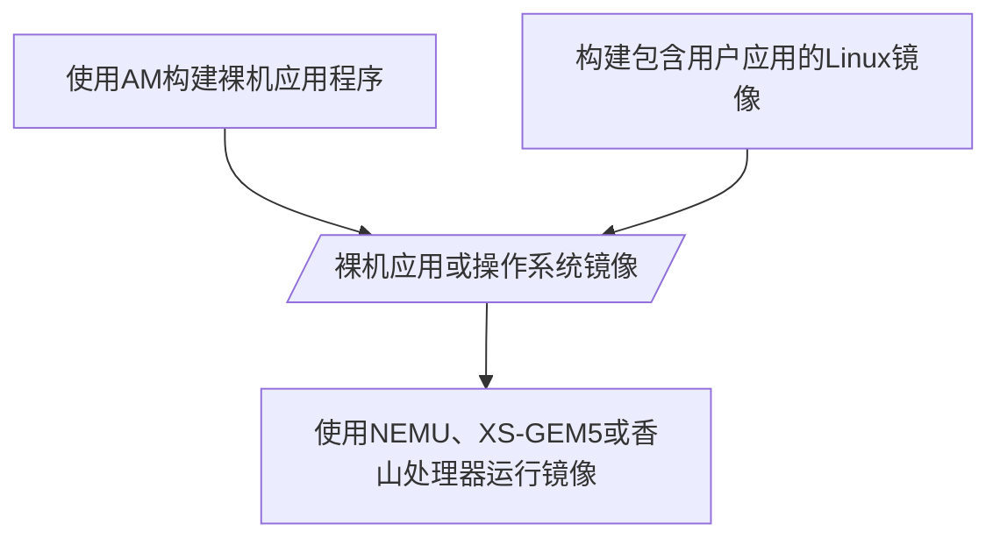
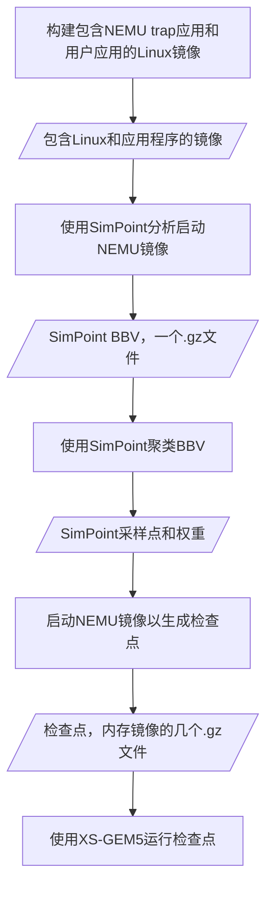

# 介绍

这是香山处理器的GEM5模拟器版本(XS-GEM5)，目前在SPEC CPU 2006基准测试上与昆明湖处理器性能相当。

## 项目特点

XS-GEM5是专门为香山处理器定制的GEM5模拟器，相比官方GEM5：
- 主要支持全系统模拟（Full System Simulation），SE模式初步支持
- 支持香山特有的格式和功能
- 包含多个香山特有的功能增强

### 主要功能增强

XS-GEM5主要包含以下增强功能：

1. **香山RVGCpt**：RISC-V的跨平台全系统检查点
2. **香山在线Difftest**：用于在线检查执行结果的API
3. **Topdown性能计数器**

4. **前端微架构校准**（与香山V3昆明湖对齐）
   - 解耦前端设计
   - TAGESC、ITTAGE和可选的Loop预测器（在SPECCPU上表现优于官方版本的LTAGE和TAGE-SCL）
   - 指令延迟与昆明湖校准

5. **后端微架构校准**（与香山V3昆明湖对齐）
   - 分布式调度器
   - 调度/执行延迟校准
   - RVV向量扩展大部分已校准

6. **缓存层次结构优化**
   - 多种预取器算法：Stream + Berti/Stride + BOP + SMS + Temporal + CDP
   - 主动/被动卸载框架
   - 多预取器协调机制
   - 所有预取器均支持VA-PA转换

7. **其他架构增强**
   - 并行RV PTW（页表遍历器）
     - 行走状态合并
     - 支持RV-H的PTW和TLB
   - 级联FMA
   - 移动消除
   - L2 TLB和TLB预取
   - CSR修复
   - 其他功能和性能bug修复

## 不支持的功能

XS-GEM5**不支持**以下功能：

1. **无法运行Boom的裸机应用程序**
   - 我们只支持[Abstract Machine](https://github.com/OpenXiangShan/nexus-am)裸机环境或香山的Linux系统

2. **无法带difftest运行ELF文件**
   - 支持GEM5的系统调用模拟（[什么是系统调用模拟](https://stackoverflow.com/questions/48986597/when-to-use-full-system-fs-vs-syscall-emulation-se-with-userland-programs-in-gem)）
   - 支持QEMU的用户空间模拟（[什么是用户空间模拟](https://www.qemu.org/docs/master/user/main.html)）
   - 不支持带Difftest做验证的运行ELF文件，当前XS-GEM5 的Difftest(NEMU) 只支持全系统模拟，不支持SE模式

3. **检查点不兼容**
   - 不能生成GEM5的SE检查点或m5检查点
   - 不能运行GEM5的SE检查点或m5检查点
   - 不推荐在M模式下生成检查点

## 使用注意事项

**请避免以下操作**：

- 在未阅读文档的情况下提交新问题
- 在未搜索问题列表的情况下提交新问题
- 使用XS-GEM5运行Boom的裸机应用程序
- 使用NEMU、XS-GEM5或香山处理器运行SimPoint bbv.gz，因为它不可引导
- 在NEMU的问题列表中提出关于构建Linux的新问题，请前往[香山文档](https://github.com/OpenXiangShan/XiangShan-doc/issues?q=is%3Aissue)


## 工作流程：如何运行工作负载

### 不使用检查点运行

运行工作负载的典型流程与[NEMU](https://github.com/OpenXiangShan/NEMU/)、[XS-GEM5](https://github.com/OpenXiangShan/GEM5)和[香山处理器](https://github.com/OpenXiangShan/XiangShan)类似。它们都只支持全系统模拟。为了准备全系统模拟的工作负载，用户需要构建裸机应用程序或在操作系统中运行用户程序。



### 使用检查点运行

对于企业用户和研究人员来说，他们更感兴趣在XS-GEM5上运行更大的工作负载，如SPECCPU。为了减少详细模拟的模拟时间，NEMU作为检查点生成器。生产和运行检查点的流程如下：



## 目录结构

```
.
├── configs/                # 配置文件目录
│   ├── example/           # 示例配置
│   │   └── xiangshan.py   # 香山处理器配置
│   └── common/            # 通用配置
├── src/                   # 源代码目录
│   ├── arch/             # 架构相关代码
│   │   └── riscv/        # RISC-V架构实现
│   ├── cpu/              # CPU相关代码
│   │   ├── o3/          # 乱序执行实现
│   │   └── pred/        # 分支预测器
│   └── mem/              # 内存系统相关代码
├── system/               # 系统相关代码
├── util/                 # 工具脚本
│   └── xs_scripts/       # 香山特有脚本
└── ext/                  # 外部依赖
    └── dramsim3/         # DRAMSim3内存模拟器
```

## 关键代码路径

### 1. 处理器配置
- `configs/example/xiangshan.py`: 香山处理器的基本配置
- `configs/common/XSConfig.py`: 香山特有的配置选项

### 2. CPU核心实现
- `src/cpu/o3/`: 乱序执行核心实现
  - `cpu.cc`: CPU核心的主要实现
  - `fetch.cc`: 取指单元
  - `decode.cc`: 解码单元
  - `rename.cc`: 重命名单元
  - `dispatch.cc`: 分发单元
  - `issue.cc`: 发射单元
  - `execute.cc`: 执行单元
  - `writeback.cc`: 写回单元

### 3. 分支预测器
- `src/cpu/pred/`: 分支预测器实现
  - BTB-based：基于传统BTB的设计
  - 详细内容查看BranchPredictor.py 中的DecoupledBPUWithBTB 模块

### 4. 内存系统
- `src/mem/`: 内存系统实现
  - `cache.cc`: 缓存实现
  - `prefetch/`: 预取器实现
  - `page_table.cc`: 页表实现

### 5. RISC-V架构支持
- `src/arch/riscv/`: RISC-V架构实现
  - `decoder.cc`: 指令解码器
  - `registers.cc`: 寄存器实现
  - `isa.cc`: 指令集实现

## 使用说明

### 环境要求
- Ubuntu 20.04/22.04
- Python 3.8（推荐使用conda环境）
- 其他依赖见README.md

### 构建步骤
1. 安装依赖
2. 克隆并构建DRAMSim3
3. 构建GEM5
4. 设置环境变量
5. 运行模拟器

详细步骤请参考README.md中的说明。

