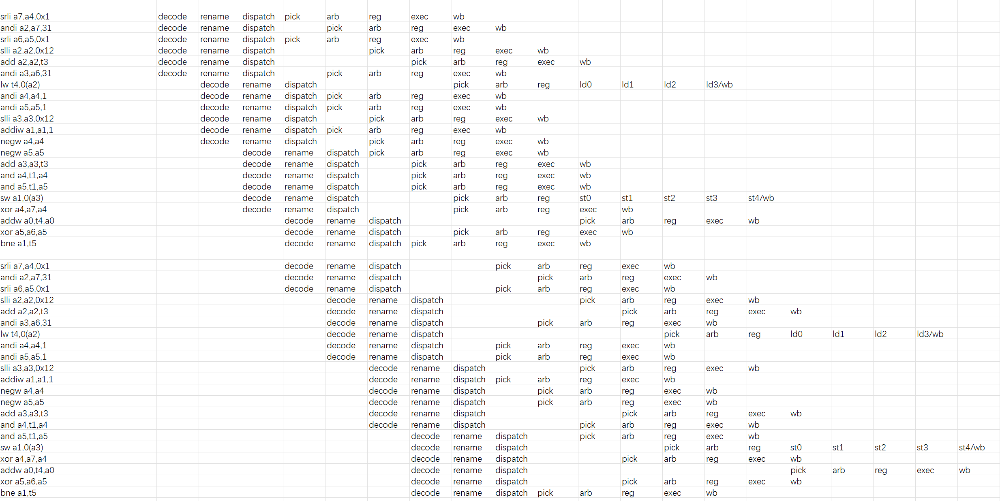
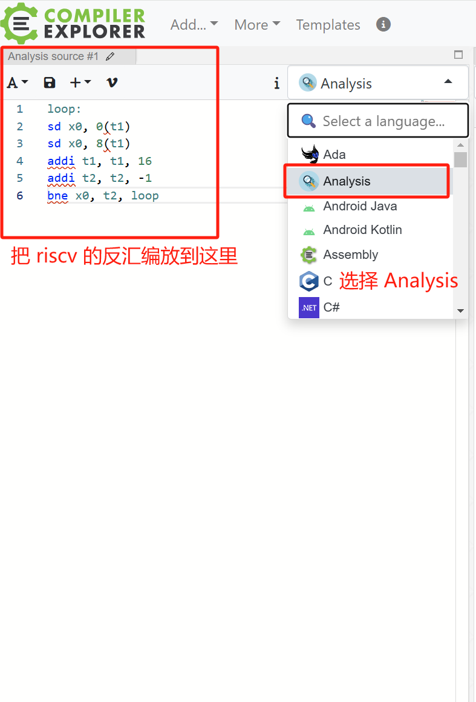
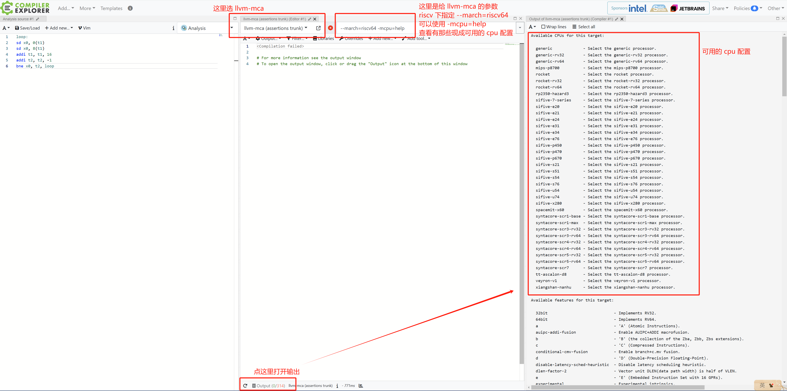
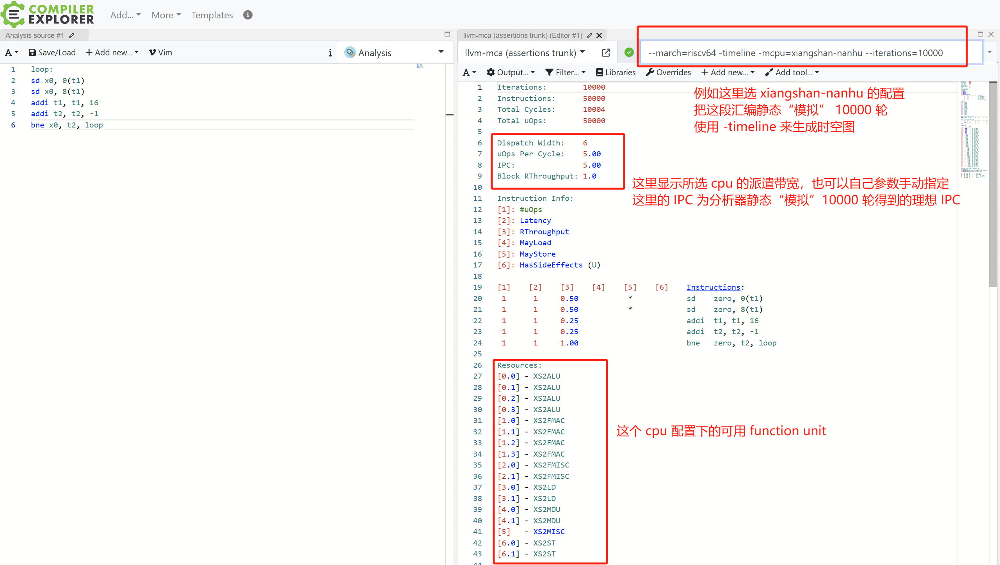
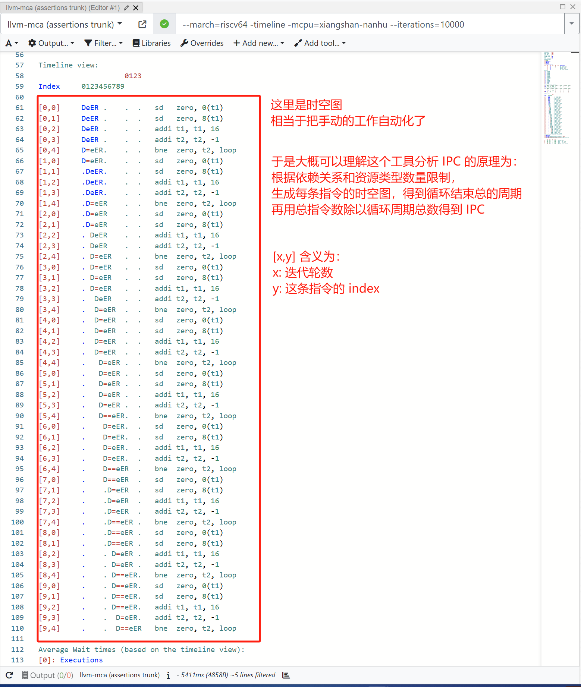
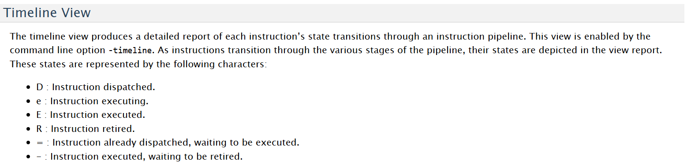
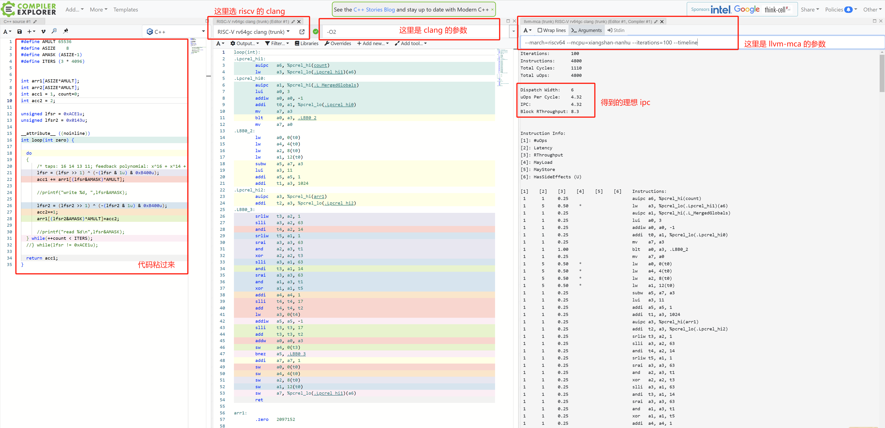

# 理想 ipc 分析工具使用方法

## 背景
给定一个热点代码片段，如何分析得到它的理想 ipc（在某一个架构配置下没有 cache miss 等阻塞，单看程序的依赖关系）

一个思路是把程序的时空图给画出来，辅助分析，例如：



根据程序指令之间的依赖关系和指令固定的延迟，确实是可以画出这样的时空图，但是手动画图的方式比较费时费力，如果有自动工具来自动完成这一过程会大幅提高分析的效率

## <font style="color:rgb(51, 51, 51);">llvm-mca 介绍</font>
<font style="color:rgb(51, 51, 51);">LLVM-mca 是一个性能分析工具，它使用 LLVM 中可用的信息(例如调度模型、发射带宽、可用 function unit 数量种类、各种 queue 的大小)静态地度量特定 CPU 执行某个代码片段的理想性能（无 icache miss，无 dcache miss）。可以帮助我们比较快速地得到一个 ipc 理想上界。</font>

## 使用方法
使用在线工具 [https://gcc.godbolt.org/](https://gcc.godbolt.org/)  会比较方便

### 1.分析反汇编
已知一段 riscv 反汇编代码例如：

```plain
loop:
sd x0, 0(t1)
sd x0, 8(t1)
addi t1, t1, 16
addi t2, t2, -1
bne x0, t2, loop
```





```plain
--march=riscv64 -timeline -mcpu=xiangshan-nanhu --iterations=1000
```







时空图中的标记 D 为指令被派遣，e 为指令执行，E 为执行完成，R 为指令提交，= 为被派遣后等待执行，- 为执行完成后等待提交

访问 [https://gcc.godbolt.org/z/K9vcn586q](https://gcc.godbolt.org/z/K9vcn586q) 可以直接打开上面这个例子

### 2.分析源代码
如果我们手头是源代码，可以先手动编译完把反汇编 dump 出来再做上面的流程。

在线工具支持从源代码编译到汇编再分析的整个流程，所以也可以直接把源代码丢到 [https://gcc.godbolt.org/](https://gcc.godbolt.org/) 里面（**但是使用在线工具的编译器编译得到的反汇编与 emu 和 gem5 实际跑的可能不一样，可能产生一定的误差**）

已知一段 microbenchmark 代码例如：

```c
#define AMULT 65536
#define ASIZE    8
#define AMASK (ASIZE-1)
#define ITERS (3 * 4096)


int arr1[ASIZE*AMULT];
int arr2[ASIZE*AMULT];


__attribute__ ((noinline))
int loop(int zero) {
  int acc1 = 1, count=0;
  int acc2 = 2;
 
  unsigned lfsr = 0xACE1u;
  unsigned lfsr2 = 0x0143u;
  do
  {
      /* taps: 16 14 13 11; feedback polynomial: x^16 + x^14 + x^13 + x^11 + 1 */
      lfsr = (lfsr >> 1) ^ (-(lfsr & 1u) & 0xB400u);    
      acc1 += arr1[(lfsr&AMASK)*AMULT];    

      lfsr2 = (lfsr2 >> 1) ^ (-(lfsr2 & 1u) & 0xB400u);
      acc2+=1;
      arr1[(lfsr2&AMASK)*AMULT]=acc2;
  
  } while(++count < ITERS);

  return acc1;
}
```



访问 [https://gcc.godbolt.org/z/jhEx1rs8x](https://gcc.godbolt.org/z/jhEx1rs8x) 可以直接打开这个例子

## 更多参考资料
<font style="color:rgb(51, 51, 51);">具体的介绍，如果使用各种参数：</font>[https://llvm.org/docs/CommandGuide/llvm-mca.html](https://llvm.org/docs/CommandGuide/llvm-mca.html)

arm 使用 llvm-mca 的一个教程：[https://learn.arm.com/learning-paths/cross-platform/mca-godbolt/](https://learn.arm.com/learning-paths/cross-platform/mca-godbolt/)

