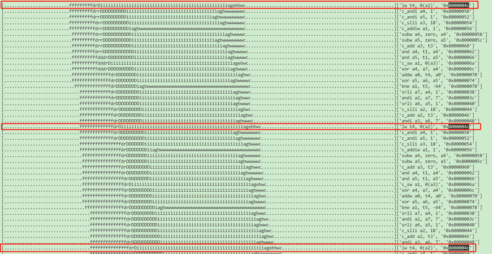
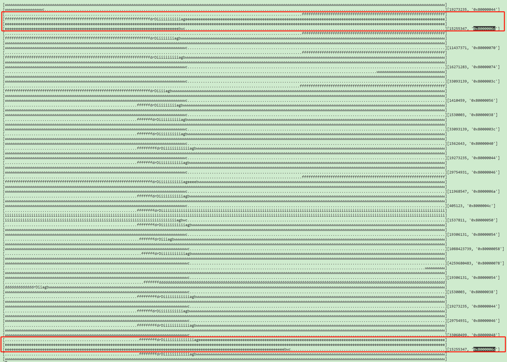

## 用例标签
使用一个规则随机读写一个大小为 8MB 的空间，执行 4096 轮，每轮包含一次读写

## 用例软件行为描述
```c
#define AMULT 65536
#define ASIZE    32
#define AMASK (ASIZE-1)
#define ITERS  4096

int arr1[ASIZE*AMULT];

int loop(int zero) {
  int acc1 = 1, count=0;
  int acc2 = 2;
 
  unsigned lfsr = 0xACE1u;
  unsigned lfsr2 = 0x0143u;

  do
  {
      /* taps: 16 14 13 11; feedback polynomial: x^16 + x^14 + x^13 + x^11 + 1 */
      lfsr = (lfsr >> 1) ^ (-(lfsr & 1u) & 0xB400u);    
      acc1 += arr1[(lfsr&AMASK)*AMULT];    

      lfsr2 = (lfsr2 >> 1) ^ (-(lfsr2 & 1u) & 0xB400u);
      acc2+=1;
      arr1[(lfsr2&AMASK)*AMULT]=acc2;
     
  } while(++count < ITERS);

  return acc1;
}
```

```plain
    80000038:	00175893          	srli	a7,a4,0x1
    8000003c:	01f8f613          	andi	a2,a7,31
    80000040:	0017d813          	srli	a6,a5,0x1
    80000044:	064a                	slli	a2,a2,0x12
    80000046:	9672                	add	a2,a2,t3
    80000048:	01f87693          	andi	a3,a6,31
    8000004c:	00062e83          	lw	t4,0(a2)
    80000050:	8b05                	andi	a4,a4,1
    80000052:	8b85                	andi	a5,a5,1
    80000054:	06ca                	slli	a3,a3,0x12
    80000056:	2585                	addiw	a1,a1,1
    80000058:	40e0073b          	negw	a4,a4
    8000005c:	40f007bb          	negw	a5,a5
    80000060:	96f2                	add	a3,a3,t3
    80000062:	00e37733          	and	a4,t1,a4
    80000066:	00f377b3          	and	a5,t1,a5
    8000006a:	c28c                	sw	a1,0(a3)
    8000006c:	00e8c733          	xor	a4,a7,a4
    80000070:	00ae853b          	addw	a0,t4,a0
    80000074:	00f847b3          	xor	a5,a6,a5
    80000078:	fde590e3          	bne	a1,t5,80000038 <loop+0x1e>
```

只会访问这 8MB 空间内的特定的 32 个位置（A，A+65536*4，A+(65536 * 2)*4，A+(65536 * 3)*4 ... A+(65536 * 31)*4），执行 4096 轮，每轮先读后写，读写之间没有依赖关系，但访存地址可能相同，访存地址会依赖于当前这轮的 lfsr，当前这轮的 lfsr 依赖上一轮的 lfsr


这个测试在 L1 和 L2 **访问同一个cache set**，cache way < 32 因此导致 cache miss

在 L3 **访问 4 个 cache set**（L3 16MB，4 slice，16 路，每一路有 4K 个 set），在 L3 不会造成 cache miss

**在 RTL 上 L2 L3 将访问同一个slice**（地址 A 所在的 slice），并且会出现 **set 阻塞**的情况


为了减小干扰，以下测试每一个 iteration 会向前执行4096 轮，最终统计本轮 iteration 减去上一轮 iteration 的数据作为本轮的结果

## 理想IPC
[https://gcc.godbolt.org/z/K9vcn586q](https://gcc.godbolt.org/z/K9vcn586q)：


使用 llvm-mca 这个工具静态分析出的理想 IPC 为 4.67（[使用方法](https://bosc.yuque.com/yny0gi/sggyey/zbn1o15bb2it46vq)）

## 理想模型IPC
（xiangshan.py --ideal-kmhv3）（commit: 0a79459c73a8）


## 模型IPC
（xiangshan.py）（commit: 0a79459c73a8）


## RTL IPC
（开预取器）（commit: cb62726bb）


## DIFF：模型理想IPC以及RTL IPC的差异
RTL 的 IPC 稳定在 0.54，GEM5 的 IPC 稳定在 3.2

## mismatch描述：什么原因造成了现在这个差异
RTL 一些关键数据：


+ Sq full rate 很低，说明 store 反压流水线的情况不存在
+ L3 Hit Rate 比较高，L2 L1 的 hit rate 都较低，说明 L3 16 路的 cache 可以兜住这 32 个访问（在 L3 访问 4 个 set），L1 4 way，L2 8 way 兜不住这 32 个块访问
+ AVG LoadMissPenalty 为 load 申请 mshr 后，到获得数据的延迟，平均 Load miss 后产生的 penalty 有 610 cycle，这个数字过大，在 L3 Hit 的情况下不应该有这么高的延迟，显然可能造成瓶颈

再看看 GEM5 的数据：


+ miss rate 与 RTL 基本可以对应上


+ GEM5 的 miss latency 是 15465 / 333 = 46 拍，大概为 L2 miss L3 hit 的延迟，达到这种延迟才算是正常的

观察 RTL 的波形，查看是否存在 Load miss penalty 过大的情况：


图中M1为Dcache发请求，M2为Dcache收到响应，中间隔了401拍，可以印证性能计数器

另外从波形中可以发现一个很重要的信息：**L2 A 通道的 ready 长期处于拉低的状态，L3 A 通道的 ready 也长期处于拉低的状态，L2 A 通道拉低会导致 L1 这边请求长期发不出去，L3 A 通道 ready 长期拉低会导致 L2 这边请求长期发不出去，最终都会反应在 L1 的 miss latency 计数器中**


做一些其他实验来辅助分析：如果把测试中的 ASIZE 设置为 4，只会访问 4 个 cache block，在 RTL 上和模型上将不会产生 cache miss

**ASIZE 设置为 4，GEM5 ideal 跑的结果：**


说明这个测试中 load miss 的延迟在 GEM5 上不是瓶颈，并不会因为 load miss 降低并行度，如果 GEM5 后端调度没有问题，理想 IPC 就是 3.2 ?（至少RTL理想IPC至少能达到这个数字）

**ASIZE 设置为 4，RTL 跑的结果：**


可以稳定在 3.2 说明 RTL IPC 0.5 到 3.2 的 gap 差距在 L1 miss 的情况下 L2 L3 的处理延迟上，也就是在访问同一个 slice，同一个 set 下 L2 L3 的访存带宽和延迟较差

**ASIZE 设置为 8，RTL 跑的结果：**


在ASIZE为 8 的情况下，RTL 的 L1 只有 4 way，L2 有 8 way，L2 可以兜住所有 8 次访问，但会出现 L1 miss，L2 hit 的情况，出现类似于 indepma_mim 的情况（L2 访问同一个 slice 的带宽出现不足的情况），即使是这种情况，平均的 load miss penalty 也只有 20，IPC 仍然可以达到 3.2，说明瓶颈不在 L2 而是主要在 L3


结论：

RTL 无法达到理想 IPC 的原因为：L2 miss，L3 hit 的情况下，请求集中访问L3同 slice，某几个 set时，L3 存在带宽不足与延迟过高的情况


波形中 L3 呈现出平均 68 个 cycle 才接收两个请求的规律

## assignee: @zhenhao @lixin
## RTL 性能瓶颈分析 @chenxi
小机房 `/nfs-nvme/home/share/lixin/2024-12-23@16:01:50.vcd.vpd`


通过对波形的进一步分析，得出如下结论：

1. 首先明确，L3 为了简化在 Non-Inclusive 策略下的设计复杂度，采用了以 set 为粒度的阻塞方案

而<font style="color:#DF2A3F;"> set 阻塞的粒度</font>，并非是 L3 的 set，<font style="color:#DF2A3F;">而是 L2 的 set</font>

也就是，对于一系列【在 L2 中 set 相同】的地址，它们在 L3 中是<font style="color:#DF2A3F;">串行执行的</font>

<details class="lake-collapse"><summary id="u34c9b1ca"><span class="ne-text">参考代码</span></summary><p id="u40aa5394" class="ne-p"><code class="ne-code"><span class="ne-text">MSHRAlloc</span></code></p><p id="ucbd1ade2" class="ne-p"></p><p id="u28f1af77" class="ne-p"><code class="ne-code"><span class="ne-text">HuanCun</span></code></p><p id="ua6ee2075" class="ne-p"></p></details>


2. 并且，L3 在收到的连续 Acquire 中间还会插入 Release

这是因为 L2 发生了替换，将替换块释放给 L3，所以 L3<font style="color:#DF2A3F;"> 还需要处理 Release</font>；

且所有的 Acquire 和 Release 处理都是串行的，L3 只用到了一个 MSHR


3. 最后，<font style="color:#DF2A3F;">一个 hit 请求对 MSHR 的占用时间会比我们预想的更长</font>（19-20 拍）

虽然 L3 hit 的 latency 没有这么长（L3 9拍返回第一个数据，11拍返回第二个数据）

（补充说明，L2 看到的是 11/13 拍，因为 L2-L3 中间有一级 buffer）


但是 L3 需要等待收到 GrantAck 后更新目录后才能释放 MSHR，增加了 MSHR 的占用时间


这就导致了吞吐量的进一步下降

<details class="lake-collapse"><summary id="ua8d983af"><span class="ne-text">参考代码</span></summary><p id="ud8dcb15d" class="ne-p"><code class="ne-code"><span class="ne-text">MSHR</span></code></p><p id="u2408a3c1" class="ne-p"></p><p id="ue825d526" class="ne-p"></p></details>


## 补充内容：
### trace 分析
perfCCT 使用方法：[https://bosc.yuque.com/yny0gi/sggyey/mc8ybawwh10mg1zc](https://bosc.yuque.com/yny0gi/sggyey/mc8ybawwh10mg1zc)

目前使用 perfCCT 可以把指令生命周期的各个阶段打出来，gem5 适配的比较好，RTL 可能有漏打错打和有时候对应不太上的问题。

gem5 的执行 trace：

```bash
# 查看图像形式
python3 util/perfcct.py m5out/test.db --zoom 1.5 -p 333 --visual | less
```



> 在 gem5 上，load 基本上不会出现过高的执行延迟，而主要卡在 iq 没有发出去和在 ibuffer 中，主要瓶颈在后端（实际 ipc 为 3.2 和理想 ipc 4.67 的差距）
>

RTL 的执行 trace（这里 RTL perfCCT 有点问题，实际 gem5 的 0x8000004c pc 对应的是 RTL 上的 0x8000006c）：

```bash
# 查看图像形式
# **RTL 注意 -p 为 1**
python3 perfcct.py  build/2024-12-30@13:54:27.db  --zoom 2.3 -p 1 -v | less
```



> RTL 上 load 指令出现大量时间卡在 execute（一大串的 e），导致后续的指令都无法提交（一大串的 w），rob 满了后导致一直反压到前端（一大串的 f），RTL 和 gem5 的差距可能来源于 load 指令的执行时间过长
>

单独看这条 load 的执行情况：

```bash
# 查看文本形式，挑选查看 pc 为 0x8000006c 的 load 的执行情况
# **RTL 注意 -p 为 1**
python3 perfcct.py  build/2024-12-30@13:54:27.db  --zoom 2.3 -p 1 | grep "0x8000006c" | less
```


可以很明显地看到 load 的执行延迟有时候非常高，~50% 4 拍执行完成（load hit），剩下的执行延迟都高于 200 拍（cache miss/lsu 内部的阻塞）。


