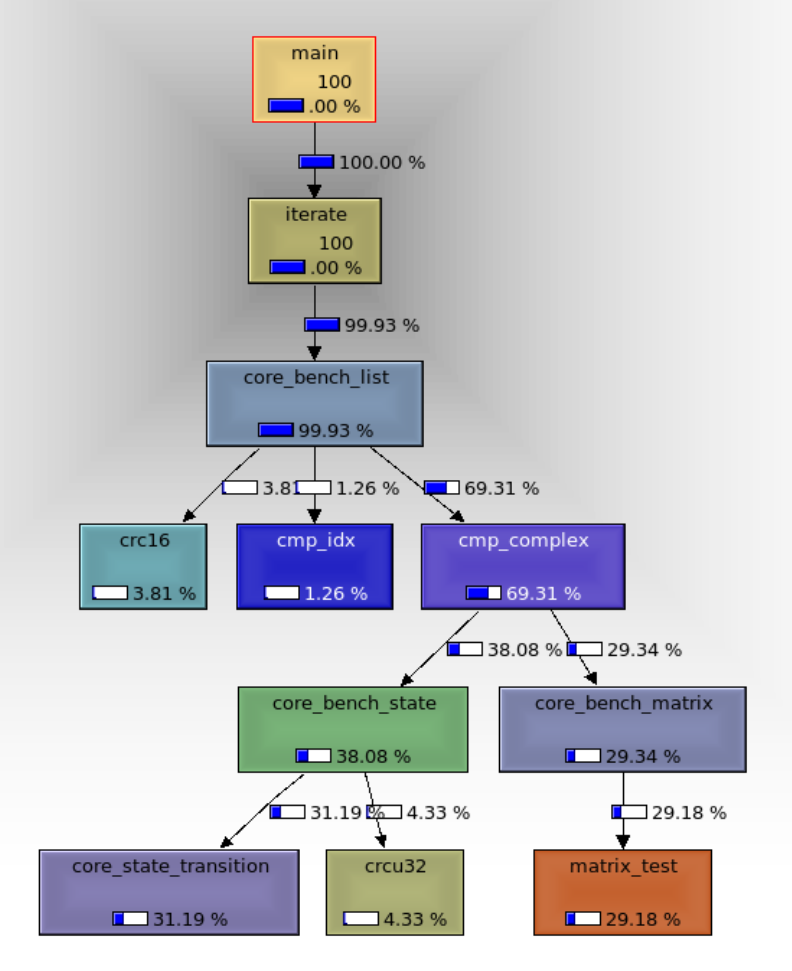

<font style="background-color:rgb(243, 243, 243);">程序会执行三种核心算法:</font>

+ <font style="background-color:rgb(243, 243, 243);">列</font><font style="background-color:rgb(243, 243, 243);">表处理</font><font style="background-color:rgb(243, 243, 243);">(List processing</font><font style="background-color:rgb(243, 243, 243);">)</font>
+ <font style="background-color:rgb(243, 243, 243);">矩</font><font style="background-color:rgb(243, 243, 243);">阵乘法</font><font style="background-color:rgb(243, 243, 243);">(Matrix multiply</font><font style="background-color:rgb(243, 243, 243);">)</font>
+ <font style="background-color:rgb(243, 243, 243);">状态机(State machine)</font>

<font style="background-color:rgb(243, 243, 243);"></font>

<font style="background-color:rgb(243, 243, 243);">参数</font>

<font style="background-color:rgb(243, 243, 243);">perf record ./coremark.exe  0x0 0x0 0x66 100000  </font>

<font style="background-color:rgb(243, 243, 243);">最后一个参数控制迭代次数，默认分数大约5万分， 7950x3d 上, 主频5.5GHz</font>

<font style="background-color:rgb(243, 243, 243);">分数计算： 迭代次数 / 时间</font>

<font style="background-color:rgb(243, 243, 243);">在node37 服务器上，只有2.7万分，主频3.7Ghz， 所以分数差异大啊！</font>

```bash
./coremark.exe  0x0 0x0 0x66 100000                                                                                            
2K performance run parameters for coremark.
CoreMark Size    : 666
Total ticks      : 3655
Total time (secs): 3.655000
Iterations/Sec   : 27359.781122
ERROR! Must execute for at least 10 secs for a valid result!
Iterations       : 100000
Compiler version : GCC11.4.0
Compiler flags   : -O2 -g -DPERFORMANCE_RUN=1  -lrt
Memory location  : Please put data memory location here
                        (e.g. code in flash, data on heap etc)
seedcrc          : 0xe9f5
[0]crclist       : 0xe714
[0]crcmatrix     : 0x1fd7
[0]crcstate      : 0x8e3a
[0]crcfinal      : 0xd340
Errors detected 
```

### <font style="color:rgb(0, 0, 0);background-color:rgb(243, 243, 243);">nemu 分数</font>
在nexus-am/apps/coremark

```bash
make clean   # 一定生成一次clean一次
make ARCH=riscv64-xs ITERATIONS=10	# 控制迭代次数
```

<font style="color:rgb(0, 0, 0);background-color:rgb(243, 243, 243);">在nemu 中</font>

```bash
make riscv64-sx_de./fconfig
make -j
./build/riscv64-nemu-interpreter -b /nfs/home/yanyue/tools/nexus-am/apps/coremark/build/coremark-10-iteration-riscv64-xs.bin
```

得到nemu 分数

| | 分数 | 比例 |
| --- | --- | --- |
| native | 50000 | |
| qemu-user |  | 20% |
| qemu-system |  | 1% |
| nemu | 1000 | 3% |
| la-emu | 1000 | 3% |


<font style="color:rgb(0, 0, 0);background-color:rgb(243, 243, 243);">可以看出在10000以上时候，分数只有100分了，分数错误</font>

<font style="color:rgb(0, 0, 0);background-color:rgb(243, 243, 243);">但是如果用20000/ 24s = 833 分，和输出分数不同！大概为原本3%！</font>

如果用qemu-system-riscv64 跑，只有100分！ 只有原本的0.5%

qemu-x86_64 运行，大概5000分，原生性能18%到20%

<font style="color:rgb(0, 0, 0);background-color:rgb(243, 243, 243);"></font>

<font style="color:rgb(0, 0, 0);background-color:rgb(243, 243, 243);">其中分析nemu 大约70% 时间在 execute, 8% +8% 在地址翻译，效率还是不错了， lA_EMU相同</font>

<font style="color:rgb(0, 0, 0);background-color:rgb(243, 243, 243);"></font>

<font style="color:rgb(0, 0, 0);background-color:rgb(243, 243, 243);">套上LA 指令数目</font>

<font style="color:rgb(0, 0, 0);background-color:rgb(243, 243, 243);">24,453,583,429      instructions</font>

<font style="color:rgb(0, 0, 0);background-color:rgb(243, 243, 243);">单独跑coremark 347,249,249 insts, 大概指令数目是70倍，</font>

ipc 也都是2.5 左右，没有太大变化


```bash
  38.06%  coremark.exe  coremark.exe       [.] core_bench_list
  14.71%  coremark.exe  coremark.exe       [.] core_state_transition
  11.89%  coremark.exe  coremark.exe       [.] matrix_mul_matrix_bitextract
   8.38%  coremark.exe  coremark.exe       [.] matrix_mul_matrix
   5.99%  coremark.exe  coremark.exe       [.] crcu32
   5.49%  coremark.exe  coremark.exe       [.] crc16
   5.01%  coremark.exe  coremark.exe       [.] matrix_test
```

```bash
main
  iterate
    core_bench_list
- 97.81% core_bench_list                                                                                                                                               ▒
      - 67.68% core_list_mergesort                                                                                                                                        ▒
         - 64.80% cmp_complex                                                                                                                                             ▒
            - calc_func                                                                                                                                                   ▒
               + 31.45% core_bench_state     core_state_transition                                                                                                                              ▒
               + 30.12% core_bench_matrix                                                                                                                                 ▒
               + 1.93% crcu16                                                                                                                                             ▒
           0.62% cmp_idx                                                                                                                                                  ▒
        13.90% core_list_reverse 
        + 9.71% crc16                                                                                                                                                       ▒
        5.60% core_list_find    
```



```bash
        10,795,255      ex_ret_brn_misp                  #      1.0 %  bad_speculation_mispredicts
                                                  #      0.0 %  bad_speculation_pipeline_restarts  (25.00%)
    31,654,469,426      de_src_op_disp.all                                                      (25.00%)
           118,137      resyncs_or_nc_redirects                                                 (25.00%)
    10,157,005,099      ls_not_halted_cyc                                                       (25.00%)
    31,046,291,664      ex_ret_ops                                                              (25.00%)
     2,698,649,337      ex_no_retire.load_not_complete   #      8.5 %  backend_bound_cpu      
                                                  #     31.6 %  backend_bound_memory     (25.00%)
    24,388,608,476      de_no_dispatch_per_slot.backend_stalls                                        (25.00%)
     3,421,214,571      ex_no_retire.not_complete                                               (25.00%)
    10,150,987,363      ls_not_halted_cyc                                                       (25.00%)
         4,119,404      ex_ret_ucode_ops                 #     50.9 %  retiring_fastpath      
                                                  #      0.0 %  retiring_microcode       (25.00%)
    10,155,086,197      ls_not_halted_cyc                                                       (25.00%)
    31,046,274,503      ex_ret_ops                                                              (25.00%)
     4,861,655,882      de_no_dispatch_per_slot.no_ops_from_frontend #      5.7 %  frontend_bound_bandwidth  (25.00%)
       228,328,837      cpu/de_no_dispatch_per_slot.no_ops_from_frontend,cmask=0x6/ #      2.2 %  frontend_bound_latency   (25.00%)
    10,159,462,011      ls_not_halted_cyc                                                       (25.00%)
```

topdown 分析发现，主要是backend 原因，其中memeory 占比最大

应该如何进一步分析呢？

```bash
valgrind --tool=cachegrind ./coremark.exe 0x0 0x0 0x66 100000
==516312== I   refs:      34,586,588,223
==516312== I1  misses:             1,659
==516312== LLi misses:             1,626
==516312== I1  miss rate:           0.00%
==516312== LLi miss rate:           0.00%
==516312== 
==516312== D   refs:       7,147,515,195  (5,721,098,319 rd   + 1,426,416,876 wr)
==516312== D1  misses:             2,354  (        1,687 rd   +           667 wr)
==516312== LLd misses:             2,026  (        1,399 rd   +           627 wr)
==516312== D1  miss rate:            0.0% (          0.0%     +           0.0%  )
==516312== LLd miss rate:            0.0% (          0.0%     +           0.0%  )
==516312== 
==516312== LL refs:                4,013  (        3,346 rd   +           667 wr)
==516312== LL misses:              3,652  (        3,025 rd   +           627 wr)
==516312== LL miss rate:             0.0% (          0.0%     +           0.0%  )  
```

发现几乎没有cache miss, 这和uprof 结果一致

uprof 发现cache miss = 0，快得多！

使用perf 继续分析，发现L1_dcache, l2_cache miss 也很小？

好绝望，我觉得topdown分析的东西非常奇怪呢？

 perf stat -e cycles,instructions,cache-references,cache-misses,L1-dcache-loads,L1-dcache-load-misses,LLC-loads,LLC-load-misses,dTLB-loads,dTLB-load-misses

```bash
perf stat -e cycles,instructions,cache-references,cache-misses,L1-dcache-loads,L1-dcache-load-misses,LLC-loads,LLC-load-misses,dTLB-loads,dTLB-load-misses ./coremark.exe 0x0 0x0 0x66 100000
2K performance run parameters for coremark.

 Performance counter stats for './coremark.exe 0x0 0x0 0x66 100000':

    10,191,149,590      cycles                                                                  (74.97%)
    34,589,809,357      instructions                     #    3.39  insn per cycle              (74.97%)
           994,775      cache-references                                                        (74.97%)
            57,537      cache-misses                     #    5.78% of all cache refs           (74.98%)
     6,480,339,090      L1-dcache-loads                                                         (75.02%)
           139,692      L1-dcache-load-misses            #    0.00% of all L1-dcache accesses   (75.07%)
   <not supported>      LLC-loads                                                             
   <not supported>      LLC-load-misses                                                       
             3,051      dTLB-loads                                                              (75.03%)
             1,102      dTLB-load-misses                 #   36.12% of all dTLB cache accesses  (74.98%)
```


通过intel vtune 分析发现，coremark 确实是后端阻塞

其中


主要是ALU 端口争用，导致branch, alu 指令所占据的较多

至于memory, 主要是L1Dcache hit latency导致的，这和amd uprof 分析结果略有区别，可能是我的运行参数设置有点小问题，但是几次分析下来，基本还是一致的


### amd uprof 使用
二进制放在/opt/AMDuProf_4.2-850/bin/

目前只有 raph-105 7950X3D  大机房服务器才安装了，ip = 172.19.20.105

AMDuProfPcm  更加类似perf stat, 但是只支持epyc 服务器，这个游戏CPU 还不支持

 AMDuProfCLI  更加类似perf record/report , 基于采样的方式

```bash
AMDuProfCLI  -h                                                         
AMDuProfCLI info -h
AMDuProfCLI info --list collect-configs
AMDuProfCLI info --list pmu-events
```

上面是常用的帮助命令，参考官方文档以及一些博客

[使用 AMD uProf 对 HB 系列进行分析 - Microsoft 社区中心 --- Profiling on HB Series with AMD uProf - Microsoft Community Hub](https://techcommunity.microsoft.com/t5/azure-high-performance-computing/profiling-on-hb-series-with-amd-uprof/ba-p/3707496)

[AMD uProf - SURF 用户知识库 - SURF 用户知识库 --- AMD uProf - SURF User Knowledge Base - SURF User Knowledge Base](https://servicedesk.surf.nl/wiki/display/WIKI/AMD+uProf)

主要常用的就是collect, report

下面是一个参考步骤

```bash
AMDuProfCLI collect --config inst_access -o /tmp/yy ./coremark.exe  0x0 0x0 0x66 100000
AMDuProfCLI report -i /tmp/yy/AMDuProf-coremark-EBP_Sep-27-2024_15-01-30
vim  /tmp/yy/AMDuProf-coremark-EBP_Sep-27-2024_15-01-30/report.csv
```

```bash
AMDuProfCLI collect --config tbp -o /tmp/yy  exe
可以获得基于时间采样的结果
FUNCTION	CPU_TIME
core_bench_list	826
matrix_mul_matrix_bitextract	261
core_state_transition	214
core_bench_state	197
matrix_mul_matrix	132

```

发现topdown 分析并没有想象中的强大

其实即便有很好的工具定位到了瓶颈在哪里，也不能自动化给出修改意见，还是要深入学习算法和体系结构这些知识，才能对性能改进有更多的建议！

topdown或者性能分析工具确实还是有许多局限性的，不要迷信


现在hmmer 分数还是差距的离谱，咋回事呢？

其他的倒还可以重新跑一下分试试吧，也可能是我gem5 配置修改过，现在统一gem5, 来全部跑一下zyy  的checkpoints吧，大概半小时

目前zyy checkpoints 大概1170个，而我的大概600+


