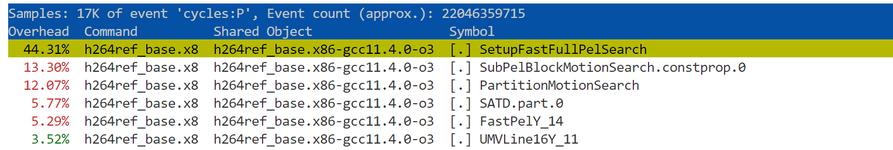
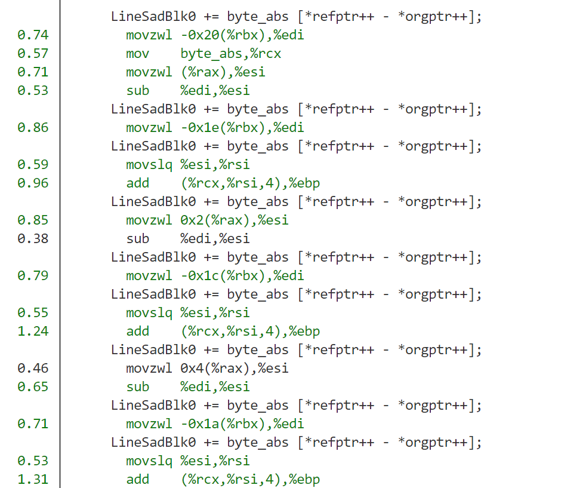

### 描述
目前h264 在6发射 分数为17分，8发射分数为18分

而intel， 龙芯等有20分，需要分析为何又性能差异


h264 是视频编解码测试，主要对系统内存、计算又要求，涉及复杂运算，使用浮点or向量单元，可多核并行。


先看看topdown， IPC =4.3

NoStall 2000万， 其中frag stall 600万，icache stall 200万， 看着比较正常


### perf 分析
看看perf

```python
/nfs/home/yanyue/tools/cpu2006v99/benchspec/CPU2006/464.h264ref/run/run_base_test_x86-gcc11.4.0-o3.0000

./h264ref_base.x86-gcc11.4.0-o3 -d foreman_test_encoder_baseline.cfg
运行10s

perf record -g
```

发现热点代码






### 核心函数1
接近一半时间在SetupFastFullPelSearch

```c

// max_pos = 1089
for (pos = 0; pos < max_pos; pos++)
    abs_y = offset_y + spiral_search_y[pos];	// 访问稀疏数组
    abs_x = offset_x + spiral_search_x[pos];
    ...
    orgptr = orig_blocks;
  // blky, y 没用，相当于把内层计算执行16次
  for (blky = 0; blky < 4; blky++)
    {
      LineSadBlk0 = LineSadBlk1 = LineSadBlk2 = LineSadBlk3 = 0;
      for (y = 0; y < 4; y++)
      {
          // static pel_t *(*PelYline_11) (pel_t *, int, int, int, int);
          // 这是一个函数指针，FastLine16Y_11, 其中abs_y++
        refptr = PelYline_11 (ref_pic, abs_y++, abs_x, img_height, img_width);
        // 访问内存数据，其中双指针不断++
        LineSadBlk0 += byte_abs [*refptr++ - *orgptr++];
        LineSadBlk0 += byte_abs [*refptr++ - *orgptr++];
        LineSadBlk0 += byte_abs [*refptr++ - *orgptr++];
        // 16个访存，++
      }
      block_sad[bindex++][pos] = LineSadBlk0;
      block_sad[bindex++][pos] = LineSadBlk1;
      block_sad[bindex++][pos] = LineSadBlk2;
      block_sad[bindex++][pos] = LineSadBlk3;
    }
  }

// height=144, width=176
pel_t *FastLine16Y_11 (pel_t *Pic, int y, int x, int height, int width)
{
  return &Pic [y*width+x];
}	// y * 176 + x
```

在这个三重循环中

```c
p *spiral_search_y@20
$9 = {0, -1, 1, -1, -1, 0, 0, 1, 1, -2, 2, -2, 2, -2, 2, -2, -2, -1, -1, 0}
p *spiral_search_x@20
$12 = {0, 0, 0, -1, 1, -1, 1, -1, 1, -1, -1, 0, 0, 1, 1, -2, 2, -2, 2, -2}
p *ref_pic@20 值比较大
$27 = {50, 216, 255, 238, 255, 255, 255, 252, 248, 255, 253, 252, 252, 253, 255, 243, 252, 253, 253, 254}
p orig_blocks=orgptr
$45 = {43, 216, 255, 249, 251, 255, 254, 253, 251, 252, 255, 255, 255, 254, 254, 253, 48, 198, 193

*refptr = 50， *orgptr = 43
p *byte_abs@20
$30 = {0, 1, 2, 3, 4, 5, 6, 7, 8, 9, 10, 11, 12, 13, 14, 15, 16, 17, 18, 19}
```

其中核心就是*refptr, *orgptr 数组的值比较随机化

而byte_abs [*refptr++ - *orgptr++]  间接访存可能难以预测，但是这和ICache stall 无关啊，这最多算是L2Bound 才对啊，而且byte_abs宽度只有512位，应该不是瓶颈才对


### 切片793 gem5 数据
看看切片h264ref_foreman.baseline_793/m5out

```json
"h264ref_foreman.baseline": {
        "insts": "525821825911",
        "points": {
            "793": "0.139477",
            "15388": "0.0464417",
            "19006": "0.0133125",
            "369": "0.0950515"
```

```c
指令占比
IntAlu      10322429     51.14%
MemRead      6645749     32.92%    
MemWrite      1670628      8.28%
    ipc                               3.55

system.cpu.iew.dispatchStallReason::NoStall     22986109                       # Number of dispatch stall reasons each tick (Total) (Count)
system.cpu.iew.dispatchStallReason::IcacheStall      5444280                       # Number of dispatch stall reasons each tick (Total) (Count)
system.cpu.iew.dispatchStallReason::FragStall      7485556                       # Number of dispatch stall reasons each tick (Total) (Count)
system.cpu.iew.dispatchStallReason::MemDQBandwidth      2516134
system.cpu.iew.dispatchStallReason::CommitSquash      2889448                       # Number of dispatch stall reasons each tick (Total) (Count)
system.cpu.iew.dispatchStallReason::total     43696680
system.cpu.iew.branchMispredicts                36660

```

看这个里面主要的几个还是icache Stall, 计算瓶颈没有太大，还有MemDQBandwidth 也有一些


### 核心函数2
看看PartitionMotionSearch 函数（另一个SubPelBlockMotionSearch 核心循环还是计算指令）

```c
//===== loop over all search positions =====
  for (pos=0; pos<max_pos; pos++, block_sad++)
  {
    if (*block_sad < min_mcost)
    {
      cand_x = offset_x + spiral_search_x[pos];
        // ***
    }
  }
```

```c
 if (*block_sad < min_mcost)                                                                                                                                                                          ▒
 15.63 │21a8:   mov       (%r12,%rax,4),%esi                                                                                                                                                                       ▒
 16.02 │        cmp       %r13d,%esi                                                                                                                                                                               ▒
       │      ↓ jge       21f6                                                                                                                                                                                     ▒
       │      cand_x = offset_x + spiral_search_x[pos];                                                                                                                                                            ▒
  2.38 │        mov       (%r10,%rax,4),%ecx                                                                                                                                                                       ▒
       │      cand_y = offset_y + spiral_search_y[pos];                                                                                                                                                            ▒
        // 。。。                                                                                                                                                                        ▒
       │      for (pos=0; pos<max_pos; pos++, block_sad++)                                                                                                                                                         ▒
 19.81 │21f6:   add       $0x1,%rax                                                                                                                                                                                ◆
 18.40 │        cmp       %rdi,%rax                                                                                                                                                                                ▒
       │      ↑ jne       21a8         
```

发现这个函数核心开销还是一个小循环，然后还得不断if 判断，很可能不进入if 条件内，而是不断i++，这里很可能导致前端的fragment, 或者是two-taken 才能缓解。


### 切片793核心循环
最后验证一下h264_baseline 中793 和核心循环是什么, 使用commitTrace + python 脚本分析得到

```c
Top 10 most common basic blocks:
Count: 305728
Instructions:
  0x67588: c_lw a0, 0(a3)
  0x6758a: c_addi a3, 4
  0x6758c: bge a0, s5, 74

Count: 305323
Instructions:
  0x675d6: c_addiw a4, 1
  0x675d8: c_addi a1, 4
  0x675da: c_addi a2, 4
  0x675dc: bne s2, a4, -84
```

刚好对应PartitionMotionSearch中的for 循环， 下面是objdump

```c
   67588:	4288                	lw	a0,0(a3)		// if 比较
   6758a:	0691                	addi	a3,a3,4
   6758c:	05555563          	bge	a0,s5,675d6 <PartitionMotionSearch+0x192c>

   675d6:	2705                	addiw	a4,a4,1		// for  i++
   675d8:	0591                	addi	a1,a1,4
   675da:	0611                	addi	a2,a2,4
   675dc:	fae916e3          	bne	s2,a4,67588 <PartitionMotionSearch+0x18de>
```


### 369切片
```json
system.cpu.ipc                               3.765852

system.cpu.scheduler.IQ_ldu.full                30949                       # count of iq full (Count)
system.cpu.scheduler.IQ_ldu.bwfull            3853877 

system.cpu.iew.dispatchedInsts               21391321                       # Number of instructions dispatched to IQ (Count)
system.cpu.iew.dispSquashedInsts                    0                       # Number of squashed instructions skipped by dispatch (Count)
system.cpu.iew.dispLoadInsts                  7638219                       # Number of dispatched load instructions (Count)
system.cpu.iew.dispStoreInsts                 1453510

system.cpu.iew.iqFullEvents                   3896719

system.cpu.iew.dispatchStallReason::MemDQBandwidth      7228268

system.cpu.commit.committedInstType_0::IntAlu     10461949     52.31%     52.31%
system.cpu.commit.committedInstType_0::MemRead      7389594     36.95%
```

这里的MemDQBandwidth 较高

并且load指令很高，可能是访存bound


核心循环， 长达100条指令的一个基本块！对应SetupFastFullPelSearch 函数

```json
Count: 87120		
Instructions:
  0x64106: lhu t6, 0(a0)
  0x6410a: lhu s11, -32(s0)
  0x6410e: lhu t3, 4(a0)

  0x64162: subw a6, a6, s6
  0x64166: sh2add t6, t6, a5

  0x6427e: addw t6, t6, t3
  0x64282: addw s2, a6, a3
  0x64286: addw s3, t6, t1
  0x6428a: beq s4, a5, 66
```

其中主要是load, store, sub, sh2add, add 这四类指令


```json
        IssueQue(name='IQ_stu', inoutPorts=2, size=2*24, fuType=[WritePort()]),
        IssueQue(name='IQ_ldu', inoutPorts=2, size=2*24, fuType=[ReadPort()]),

        IssueQue(name='IQ_stu', inoutPorts=3, size=3*16, fuType=[WritePort()]),
        IssueQue(name='IQ_ldu', inoutPorts=3, size=3*16, fuType=[ReadPort()]),
```

神奇，把发射队列宽度更改后，RTL那边是1个Load IQ + 1 Store IQ + 1 Ld/St IQ, 每个能发射两条指令，对应最多能发射3个Load指令

改了之后，ipc 从3.76 提升到4.181760， 提升了10%！

system.cpu.iew.dispatchStallReason::MemDQBandwidth         8010  下降非常多！


 score：

h264ref  382.775   22130.0  19.272       1.0

h264 的分数也从17.63分（6发射）， 18.34分（8发射）提升到19.27分，至少目前gem5和RTL 分数比较一致了！

### 结论
目前h264 的计算、访存等并不存在瓶颈

还是在取指令模块，由于for循环内不断有if判断，导致取指带宽不足

需要two taken 来解决！

解决后，ipc 能从3.5到6， 分数从(15->25 ) * 13% = 1.3分，预估能带来1分多的提升。

此外，修改成3个Load IQ 也能带来1分的性能提升。

