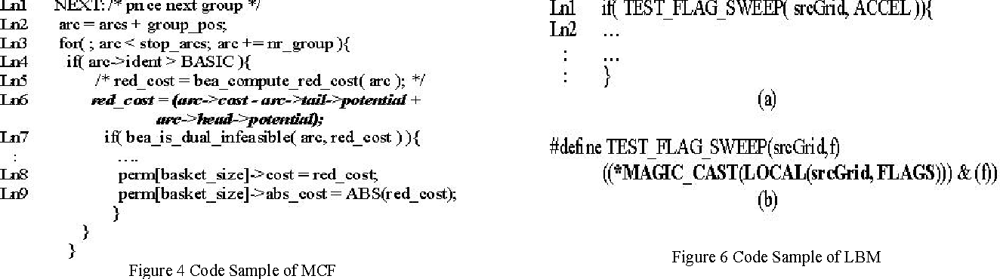

参考论文：<font style="color:rgb(0,0,0);">Performance Characterization of SPEC CPU2006 Benchmarks on Intel Core 2 Duo Processor</font>

<font style="color:rgb(0,0,0);">在考虑的 </font>

<font style="color:rgb(0,0,0);">cpu2006 和 cpu2000 基准测试集中，平均每 1000 条指令的 L1D 缓存未命中次数分别为 22.5 和 27。在 CPU2000 和 CPU2006 基准测试中，mcf 基准测试具有最高的每 1000 条指 令的 L1 缓存未命中次数。这是其 IPC 低的重要原因之一。 </font>

<font style="color:rgb(0,0,0);">Mcf 是一个用 C 语言编写的内存密集型整数基准测试。使用 Intel(R) VTune(TM) 性能分析器 8.0.1 进行代码分析显示， 负责对各种处理器单元施加压力的关键函数是 primal_bea_mpp 和 refresh_potential。Primal_bea_mpp（72.6%）和 refresh_potential（12.8%）共同负责了 85% 的整体 L1 数据缓存未命中事件。</font>

<font style="color:rgb(0,0,0);">图 4 展示了 primal_bea_mpp 函数的代码示例。该函数遍历一 个指向一组结构的指针数组（用 arc_t 表示）。对于每个遍历 的结构，它优化了用于大规模通信的例程。在考虑的代码中， 第 6 行的指针追踪负责整个程序超过 50%的 L1D 缓存未命 中。在 CPU2000 中，mcf 的类似结果也在先前的工作[11]中发 现。除了 mcf 之外，lbm 在 CPU2006 中具有相对显著的 L1 缓存未命中率，而 mcf、art 和 swim 在 CPU2006 中具有相对 显著的 L1 缓存未命中率。</font>




```c
arc_t *primal_bea_mpp( long m,  arc_t *arcs, arc_t *stop_arcs, 
                              cost_t *red_cost_of_bea )
// 初始化perm 数组
if( initialize )
    {
        for( i=1; i < K+B+1; i++ )
            perm[i] = &(basket[i]);
        nr_group = ( (m-1) / K ) + 1; 	// K = 300
        group_pos = 0;
        basket_size = 0;
        initialize = 0;
    }
// 重用basket 已有的弧
// 核心循环
NEXT:
    arc = arcs + group_pos;
    // 以nr_group为步长扫描弧/边
    for( ; arc < stop_arcs; arc += nr_group )
    {
        if( arc->ident > BASIC )  // 只考虑非基本弧
        {   // 计算cost = 边cost + 两个节点 cost
            red_cost = arc->cost - arc->tail->potential + arc->head->potential;
            // 检查是否对偶不可行
            if( bea_is_dual_infeasible( arc, red_cost ) )  // 复杂分支判断
            {
                // 将符合条件的弧添加到basket中
                basket_size++;
                perm[basket_size]->a = arc;
                perm[basket_size]->cost = red_cost;
                perm[basket_size]->abs_cost = ABS(red_cost);
            }
        }
    }

// 网络流：特殊的图：有方向的边+每个边有流量+每个边有成本
// arc 结构体，图中边
struct arc {
    cost_t cost;          // 当前弧的成本
    node_p tail, head;    // 弧的起点和终点节点
    int ident;            // 弧的标识（状态）
    arc_p nextout;        // 同一起点的下一条出弧
    arc_p nextin;         // 同一终点的下一条入弧
    flow_t flow;          // 弧上的流量
    cost_t org_cost;      // 原始成本（未修改的）
};
// nextout和nextin形成双向邻接表
// 双向邻接表：能遍历入边所有边，也能遍历出边所有边

// node 结构体，节点
struct node {
    cost_t potential;      // 节点势能(dual variable)，用于简化成本计算
    int orientation;       // 节点在树中的方向
    
    // 树结构相关指针
    node_p child;         // 指向子节点
    node_p pred;          // 指向父节点
    node_p sibling;       // 指向兄弟节点
    node_p sibling_prev;  // 指向前一个兄弟节点
    
    // 网络流相关指针
    arc_p basic_arc;      // 基弧（在生成树中的弧）
    arc_p firstout;       // 从该节点出发的第一条弧
    arc_p firstin;        // 进入该节点的第一条弧
    arc_p arc_tmp;        // 临时弧指针
    
    // 流量和其他属性
    flow_t flow;          // 节点流量
    long depth;           // 在树中的深度
    int number;           // 节点编号
    int time;             // 时间戳
};
// 用使用child、pred、sibling维护一个树形结构，这是实现最小生成树的基础
// firstout和firstin构成邻接表，用于快速访问与节点相连的所有弧
// 整个结构超过Cacheline 大小了！> 64KB

int bea_is_dual_infeasible( arc_t *arc, cost_t red_cost )
{
    return(    (red_cost < 0 && arc->ident == AT_LOWER)
            || (red_cost > 0 && arc->ident == AT_UPPER) );
}
```

如下是x86 perf result 结果：主要开销

```c
NEXT:                                                                                                                                              ▒
       │     /* price next group */                                                                                                                             ▒
       │     arc = arcs + group_pos;                                                                                                                            ▒
       │     for( ; arc < stop_arcs; arc += nr_group )                                                                                                          ▒
  6.95 │131:   mov    nr_group,%rax                                                                                                                             ▒
  5.89 │       shl    $0x6,%rax                                                                                                                                 ▒
  2.86 │       add    %rax,%rbx                                                                                                                                 ▒
  4.06 │13f:   cmp    %r12,%rbx                                                                                                                                 ▒
       │     ↓ jae    19e                                                                                                                                       ▒
       │     {                                                                                                                                                  ▒
       │     if( arc->ident > BASIC )                                                                                                                           ▒
  4.00 │       cmpl   $0x0,0x18(%rbx)                                                                                                                           ▒
  5.10 │     ↑ jle    131                                                                                                                                       ▒
       │     {                                                                                                                                                  ▒
       │     /* red_cost = bea_compute_red_cost( arc ); */                                                                                                      ▒
       │     red_cost = arc->cost - arc->tail->potential + arc->head->potential;                                                                                ▒
  6.52 │       mov    (%rbx),%rbp                                                                                                                               ▒
  7.10 │       mov    0x8(%rbx),%rax                                                                                                                            ◆
  7.98 │       sub    (%rax),%rbp                                                                                                                               ▒
  5.58 │       mov    0x10(%rbx),%rax                                                                                                                           ▒
  4.78 │       add    (%rax),%rbp                                                                                                                               ▒
       │     if( bea_is_dual_infeasible( arc, red_cost ) )                                                                                                      ▒
  7.92 │       mov    %rbp,%rsi                                                                                                                                 ▒
  4.68 │       mov    %rbx,%rdi                                                                                                                                 ▒
 10.28 │     → call   bea_is_dual_infeasible                                                                                                                    ▒
 10.52 │       test   %eax,%eax                                                                                                                                 ▒
  0.00 │     ↑ je     131               
```

主要有3大开销：

1. for 循环跨步访问大
+ <font style="background-color:rgb(243, 243, 243);">arc_t</font><font style="color:rgb(0, 0, 0);background-color:rgb(243, 243, 243);">大小为64字节，</font><font style="background-color:rgb(243, 243, 243);">nr_group</font><font style="color:rgb(0, 0, 0);background-color:rgb(243, 243, 243);">为300</font>
+ <font style="color:rgb(0, 0, 0);background-color:rgb(243, 243, 243);">每次跳跃约19200字节， </font><font style="color:#DF2A3F;background-color:rgb(243, 243, 243);">应该用更大stride 的预取器有效果吧，berti有作用，能完全覆盖吗？</font>
+ <font style="color:#DF2A3F;background-color:rgb(243, 243, 243);">用printf 打印发现，test: nr_group 大约=342， 8319, 循环次数为300次</font>
+ <font style="color:#DF2A3F;background-color:rgb(243, 243, 243);">ref: nr_group=870, 9万多，估计不行了</font>
2. 内存访问开销

```c
6.52% │ mov    (%rbx),%rbp        # 加载arc->cost
7.10% │ mov    0x8(%rbx),%rax     # 加载arc->tail
7.98% │ sub    (%rax),%rbp        # 减去tail->potential
5.58% │ mov    0x10(%rbx),%rax    # 加载arc->head
4.78% │ add    (%rax),%rbp        # 加上head->potential
```

有3个指针访问，而且还不是链表，可能不太好优化

<font style="color:rgb(0, 0, 0);background-color:rgb(243, 243, 243);">访存序列：</font>

+ <font style="background-color:rgb(243, 243, 243);">arc->cost</font><font style="color:rgb(0, 0, 0);background-color:rgb(243, 243, 243);"> </font><font style="color:rgb(0, 0, 0);background-color:rgb(243, 243, 243);">(偏移0</font><font style="color:rgb(0, 0, 0);background-color:rgb(243, 243, 243);">)</font>
+ <font style="background-color:rgb(243, 243, 243);">arc->tail</font><font style="color:rgb(0, 0, 0);background-color:rgb(243, 243, 243);"> </font><font style="color:rgb(0, 0, 0);background-color:rgb(243, 243, 243);">(偏移</font><font style="color:rgb(0, 0, 0);background-color:rgb(243, 243, 243);">8)</font>
+ <font style="background-color:rgb(243, 243, 243);">arc->tail->potential</font><font style="color:rgb(0, 0, 0);background-color:rgb(243, 243, 243);"> </font><font style="color:rgb(0, 0, 0);background-color:rgb(243, 243, 243);">(间</font><font style="color:rgb(0, 0, 0);background-color:rgb(243, 243, 243);">接访问)</font>
+ <font style="background-color:rgb(243, 243, 243);">arc-></font><font style="background-color:rgb(243, 243, 243);">head</font><font style="color:rgb(0, 0, 0);background-color:rgb(243, 243, 243);"> </font><font style="color:rgb(0, 0, 0);background-color:rgb(243, 243, 243);">(偏移16)</font>
+ <font style="background-color:rgb(243, 243, 243);">arc->head->potential</font><font style="color:rgb(0, 0, 0);background-color:rgb(243, 243, 243);"> (间接访问)</font>

<font style="color:rgb(0, 0, 0);background-color:rgb(243, 243, 243);">多次连续的内存访问形成依赖链，</font><font style="color:#DF2A3F;background-color:rgb(243, 243, 243);">有优化方法吗？更激进的预取器？</font>

3. bea_is_dual_infeasible<font style="color:rgb(0, 0, 0);background-color:rgb(243, 243, 243);">的返回值可能难以预测， 不太好优化，</font><font style="color:#DF2A3F;background-color:rgb(243, 243, 243);">two-taken 或许有帮助</font><font style="color:rgb(0, 0, 0);background-color:rgb(243, 243, 243);">  
</font>

<font style="color:rgb(0, 0, 0);background-color:rgb(243, 243, 243);"></font>

<font style="color:rgb(0, 0, 0);background-color:rgb(243, 243, 243);">用编译器来尝试一下，发现确实是这样的</font>

[https://godbolt.org/z/1rf59h9ob](https://godbolt.org/z/1rf59h9ob)  
如果都有条件指令，  
riscv 都是一个分支+1个条件指令  
arm 1分支+2个条件  
如果不开zicond  
riscv 是两分支  
arm 的条件和你之前分析一致，我觉得zicond 是有效的  

接下来尝试用zicond 来编译mcf, 看看核心循环是否变成这样了！

再生成新的切片看看性能！


然而事实上用编译器发现

如果对于有指针的情况，是无法正确生成zicond指令的  
[https://godbolt.org/z/nj3TMosnY](https://godbolt.org/z/nj3TMosnY)  
对应gcc12的切片也能发现

```c
# 对应 for 循环的初始化: arc = arcs + group_pos;
10a4e: 00671793   slli a5,a4,0x6    # a5 = group_pos << 6 (乘以64,因为arc_t结构体大小)
10a52: 97b6       add  a5,a5,a3     # a5 = arcs + group_pos*64

# 对应 for 循环的条件检查: arc < stop_arcs
10a54: 01b7e963   bltu a5,s11,10a66 # 如果 arc < stop_arcs, 跳转到10a66继续循环体
10a58: a095       j    10abc        # 否则跳出循环

# 对应 bea_is_dual_infeasible 函数的判断逻辑
10a5a: c299       beqz a3,10a60     # 如果 red_cost == 0, 跳转到10a60： next iteration
10a5c: 031f0963   beq  t5,a7,10a8e  # 比较 arc->ident 和某个值

10a60:	97aa      add	a5,a5,a0
10a62:	05b7fd63  bgeu	a5,s11,10abc <main+0x5a4>
# 循环体内的代码
10a66: 0187af03   lw   t5,24(a5)    # 加载 arc->ident
10a6a: ffe05be3   blez t5,10a60     # 检查 if(arc->ident > BASIC)

# 计算 red_cost = arc->cost - arc->tail->potential + arc->head->potential
10a6e: 0087b283   ld   t0,8(a5)     # 加载 arc->tail
10a72: 0107bf83   ld   t6,16(a5)    # 加载 arc->head
10a76: 6394       ld   a3,0(a5)     # 加载 arc->cost
10a78: 0002b283   ld   t0,0(t0)     # 加载 arc->tail->potential
10a7c: 000fbf83   ld   t6,0(t6)     # 加载 arc->head->potential
10a80: 405686b3   sub  a3,a3,t0     # a3 = cost - tail->potential
10a84: 96fe       add  a3,a3,t6     # a3 = cost - tail->potential + head->potential
```

其中10a5a 这条分支非常难预测，在mcf_12253 切片中（权重0.13）

这条分支错误预测率为35%， 总分支指令数=2920385 直接贡献了MPKI 接近5

说明很难预测a3=red_cost 是否为0


### LTO
GCC 14.2 与 GCC 当前master分支(2024.11.14-commit 2272cd2508)

LTO 编译时可调换 red_cost == 0 与 arc->ident 的分支顺序，使得分支预测错误率大幅下降。

