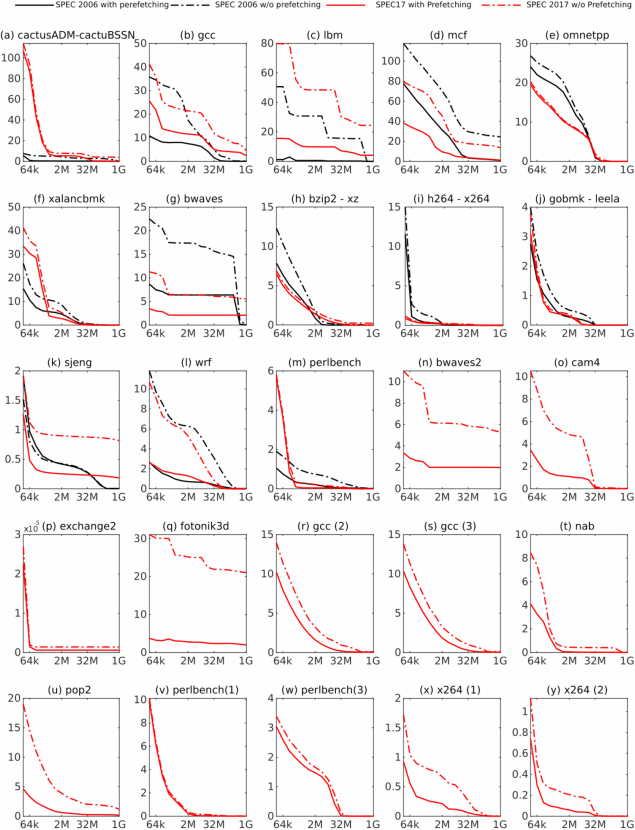
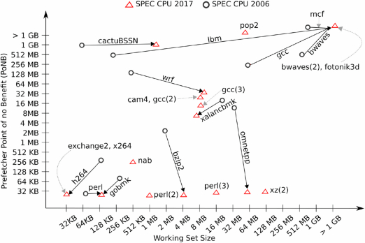
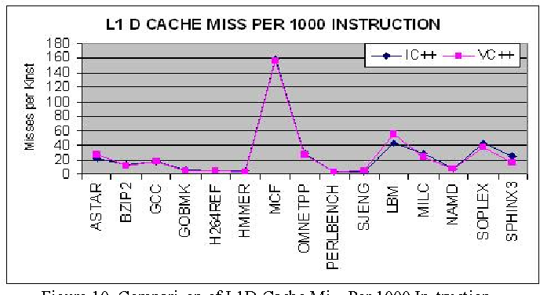
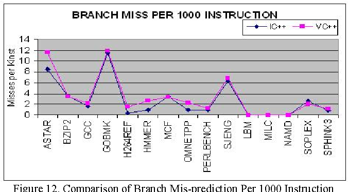
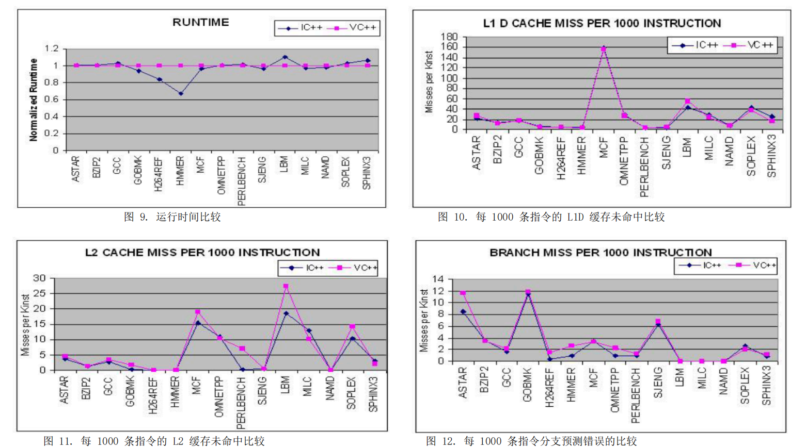
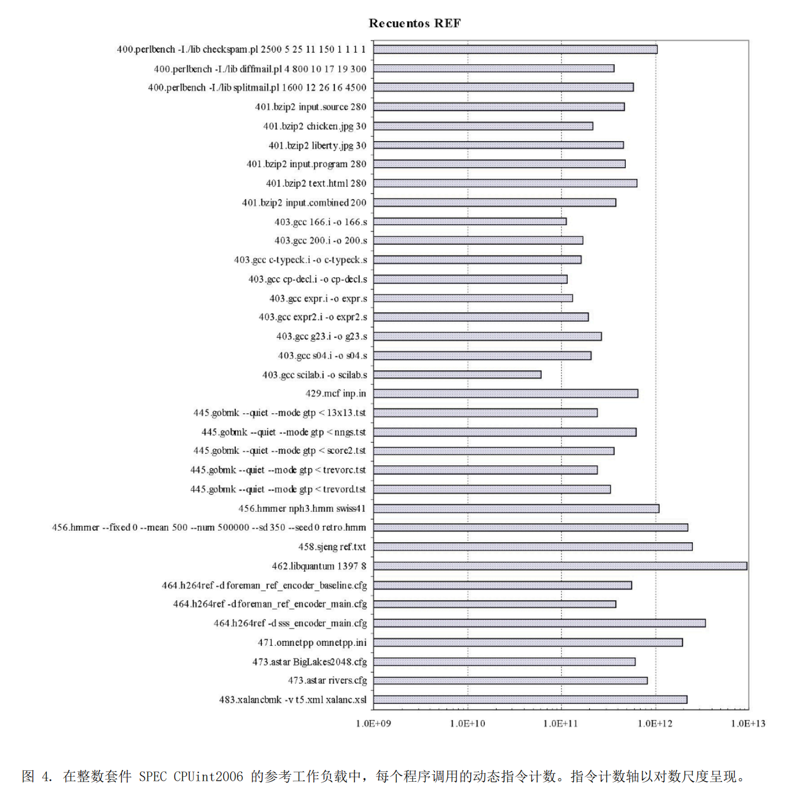
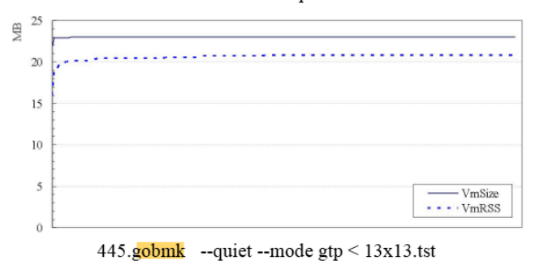

### 总览
| id | int | float |
| --- | --- | --- |
| 1 | <font style="color:rgb(0,0,0);">400.perlbench </font> | <font style="color:rgb(0,0,0);">410.bwaves </font> |
| 2 | <font style="color:rgb(0,0,0);">401.bzip2 </font> | <font style="color:rgb(0,0,0);">416.gamess </font> |
| 3 | <font style="color:rgb(0,0,0);">403.gcc </font> | <font style="color:rgb(0,0,0);">433.milc </font> |
| 4 | <font style="color:rgb(0,0,0);">429.mcf </font> | <font style="color:rgb(0,0,0);">434.zeusmp </font> |
| 5 | <font style="color:rgb(0,0,0);">445.gobmk </font> | <font style="color:rgb(0,0,0);">435.gromacs </font> |
| 6 | <font style="color:rgb(0,0,0);">456.hmmer </font> | <font style="color:rgb(0,0,0);">436.cactusADM </font> |
| 7 | <font style="color:rgb(0,0,0);">458.sjeng </font> | <font style="color:rgb(0,0,0);">437.leslie3d </font> |
| 8 | <font style="color:rgb(0,0,0);">462.libquantum </font> | <font style="color:rgb(0,0,0);">444.namd </font> |
| 9 | <font style="color:rgb(0,0,0);">464.h264ref </font> | <font style="color:rgb(0,0,0);">447.dealII </font> |
| 10 | <font style="color:rgb(0,0,0);">471.omnetpp </font> | <font style="color:rgb(0,0,0);">450.soplex </font> |
| 11 | <font style="color:rgb(0,0,0);">473.astar </font> | <font style="color:rgb(0,0,0);">453.povray </font> |
| 12 | <font style="color:rgb(0,0,0);">483.xalancbmk</font> | <font style="color:rgb(0,0,0);">454.calculix </font> |
| 13 | <font style="color:rgb(0,0,0);"></font> | <font style="color:rgb(0,0,0);">459.GemsFDTD </font> |
| 14 |  | <font style="color:rgb(0,0,0);">465.tonto </font> |
| 15 |  | <font style="color:rgb(0,0,0);">470.lbm </font> |
| 16 |  | <font style="color:rgb(0,0,0);">481.wrf </font> |
| 17 |  | <font style="color:rgb(0,0,0);">482.sphinx3 </font> |


总共12 个int + 17个浮点=  29个，重点关注int


### DCache与预取
参考论文：

A Reusable Characterization of the Memory System Behavior of SPEC2017 and SPEC2006

[https://dl.acm.org/doi/fullHtml/10.1145/3446200](https://dl.acm.org/doi/fullHtml/10.1145/3446200)

是否带有预取，cache 大小（单级cache总大小），对应的MPKI



对于spec 2006, gcc, mcf, omnetpp, bzip2应该都有相应的下降才对

我应该分析下gem5: DCache MPKI，L1I/L1D=128KB,L2=1M,L3=16MB

其中mcf: L1D = 300, L2 = 90, L3=192，相对图中太高了

omnetpp 随着Cache大小怎大还可以下降，目前是平均40，应该能降到20多

修改L2=2M试试，omnetpp，mcf应该有收益


<font style="color:rgb(51, 51, 51);">关于一般预取器敏感性，我们看到 gcc、lbm、mcf、xalancbmk 和 bwaves，wrf 从预取中获得了显着的收益，而 cactuADM-cactuBSSN、omnetpp、leela、x264 和 perlbench 收益甚微。</font>

<font style="color:rgb(51, 51, 51);">mcf 和 lbm 都受益于小缓存大小的预取，其中差异可能高达 40 MPKI</font>

<font style="color:rgb(51, 51, 51);">对于spec2006, 其中gobmk 在从64k 变为128k 情况下，MPKI 下降显著</font>

<font style="color:rgb(51, 51, 51);"></font>

<font style="color:rgb(51, 51, 51);"></font>



<font style="color:rgb(51, 51, 51);">图 4.聚合应用程序缓存和预取器敏感度以及 SPEC 2006 和 SPEC 2017 之间的变化。缓存工作集大小显示在 </font><font style="color:rgb(51, 51, 51);">x</font><font style="color:rgb(51, 51, 51);"> -轴,同时 </font><font style="color:rgb(51, 51, 51);">y</font><font style="color:rgb(51, 51, 51);"> -axis 显示预取器无益处点 (PoNB)。</font>

<font style="color:rgb(51, 51, 51);">能看出：mcf, lbm, cactusBSSN, wrf, gcc 对预取要求高</font>

<font style="color:rgb(51, 51, 51);"></font>

### <font style="color:rgb(51, 51, 51);">ICache与分支预测</font>
<font style="color:rgb(51, 51, 51);">论文：</font><font style="color:rgb(46, 55, 67);background-color:rgb(235, 236, 237);">Performance Characterization of SPEC CPU 2006 Benchmarks on Intel Core 2 Duo Processor</font>



能看出mcf 对L1 DCache miss 很大，目前gem5: l1D MKPI=300!




对分支预测来说，astar, gobmk, sjeng 的MPKI比较大，达到10了

但gem5这里测试，MPKI: astar = 23, gobmk = 15 -> 11

bzip2, omnetpp, sjeng, soplex,  为7， 举例图中还有差异！说明<font style="color:#DF2A3F;">分支预测还有空间 </font>

mcf =17, 和论文中差异也很大？




**<font style="color:rgb(51, 51, 51);"></font>**

**<font style="color:rgb(51, 51, 51);"></font>**


<font style="color:rgb(51, 51, 51);"></font>

<font style="color:rgb(51, 51, 51);"> 论文： SPEC CPUint2006 characterization， Rafael Rico, Virginia Escude， 2009</font>



占比内存一直比较高，大约20MB, 超过dcache=64KB， L2=1M



perf record 没有什么热点函数

```c
   5.71%  445.gobmk  445.gobmk          [.] fastlib                                                                                                                                                                                            ◆
   5.33%  445.gobmk  445.gobmk          [.] scan_for_patterns                                                                                                                                                                                  ▒
   5.02%  445.gobmk  445.gobmk          [.] order_moves.lto_priv.0                                                                                                                                                                             ▒
   4.50%  445.gobmk  445.gobmk          [.] incremental_order_moves                                                                                                                                                                            ▒
   3.89%  445.gobmk  445.gobmk          [.] undo_trymove                                                                                                                                                                                       ▒
   3.65%  445.gobmk  445.gobmk          [.] do_play_move                                                                                                                                                                                       ▒
   3.38%  445.gobmk  445.gobmk          [.] compute_connection_distances 
```

