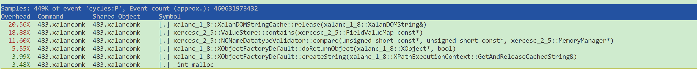
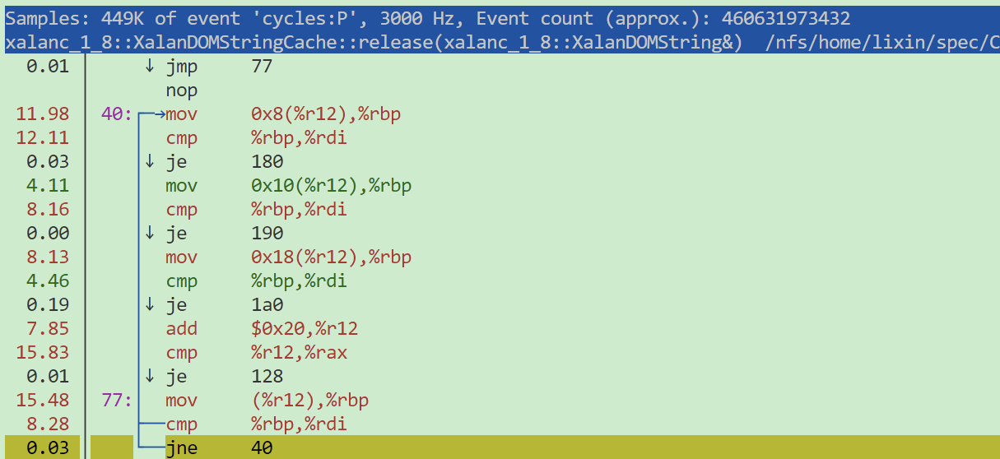
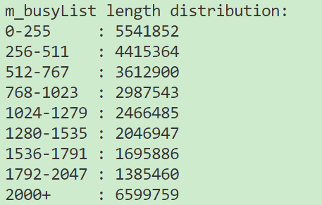
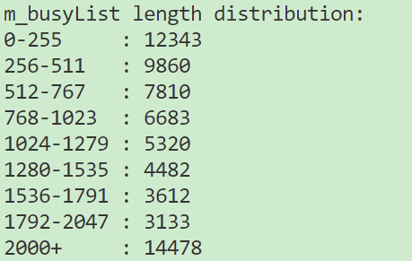
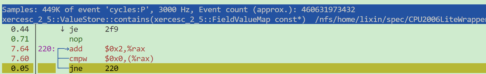
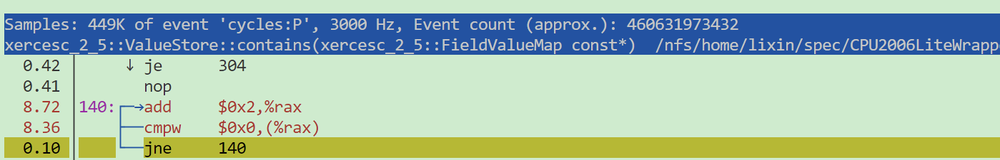
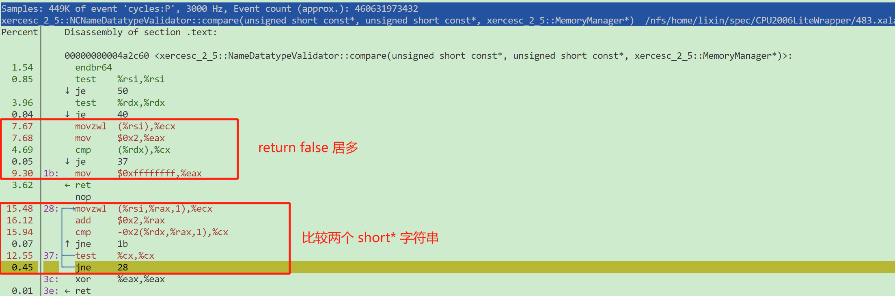
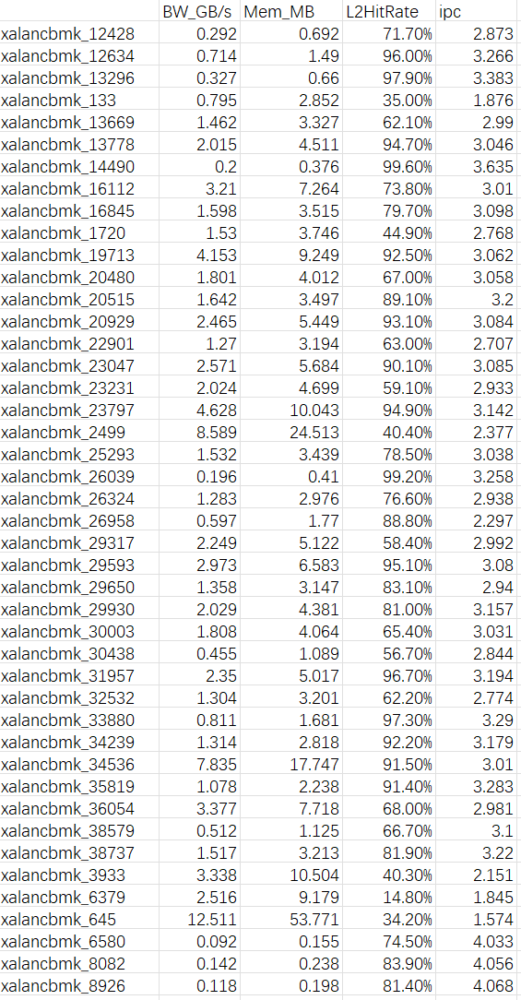

perf record -F 3000 ./build/483.xalancbmk -v data/ref/input/t5.xml  data/ref/input/xalanc.xsl > ref.out


主要的热点如下：




### release
release 的热点主要在 find 上

```cpp
typedef std::vector<XalanDOMString*>	StringListType;
typedef unsigned short	XalanDOMChar;

class XALAN_DOM_EXPORT XalanDOMString
{
typedef vector<XalanDOMChar>		XalanDOMCharVectorType;
private:

	XalanDOMCharVectorType		m_data;

	size_type					m_size;

	static const XalanDOMChar	s_empty;
};

bool
XalanDOMStringCache::release(XalanDOMString&	theString)
{
	XALAN_USING_STD(find)
    // 遍历 m_busyList 找是否存在 theString
	StringListType::iterator	i =
		find(m_busyList.begin(),
			 m_busyList.end(),
			 &theString);
    // 没找到返回
	if (i == m_busyList.end())
	{
		return false;
	}
	else
	{
        // 找到
        // available 太多，删掉
		if (m_availableList.size() > m_maximumSize)
		{
			delete *i;
		}
		else
		{
			theString.erase();
            // 把找到的这个复制到 available 里面，这里会访问所有的 i 指向的 private 成员
			m_availableList.push_back(*i);
		}
        // 从 m_busyList 删掉，产生 vector 从后向前的移动
		m_busyList.erase(i);

		return true;
	}
}
```



find 的反汇编如上，循环展开了 4 次去访问一个指针数组



统计了一下每次 find 遍历的 m_busyList 数组元素个数的分布如上



由于每次访问 m_busyList 都是同一个东西，所以统计一下 m_busyList 的大小分布如上（最大不会超过万量级），L1 cache 勉强放得下，L2 cache 一定可以放得下，stream 预取一次就够用了。

如果 L2 cache 无用预取太多，可能会把 m_busyList 从 L1 踢掉？（CDP 不检测 stream 预取上来的快？？）

> 试验了一下 CDP 不检测 stream 的块
>
> xalancbmk 25.786->25.799；omnetpp 17.786->17.794；astar 10.075->10.067；**mcf 23.088->22.775**
>
> 看结果对 xalancbmk 作用不大，反而 mcf 下降比较多，参考对 [mcf 的热点分析](https://bosc.yuque.com/yny0gi/sggyey/dbpzyyep1s5u9pbi) 中 primal_bea_mpp 函数中的perm 是个指针数组，存在对它的 stream 访问，CDP 在这个模式下能取得收益。
>
> 看来不能这样简单地让 CDP 不检测 stream 的块
>


### contains & compare
contains 的主要热点在 stringLen 上，里面调用了比较多的 compare，compare 就是字符串比较

```cpp
bool ValueStore::contains(const FieldValueMap* const other) {

    if (fValueTuples) {

        unsigned int otherSize = other->size();
        unsigned int tupleSize = fValueTuples->size();

        for (unsigned int i=0; i<tupleSize; i++) {

            FieldValueMap* valueMap = fValueTuples->elementAt(i);
            // 这里是对一个指针数组做顺序查找，找到一个 size 相同的
            if (otherSize == valueMap->size()) {

                bool matchFound = true;

                for (unsigned int j=0; j<otherSize; j++) {
                    // 顺序看指针数组里面每一个元素的 type 和 value
                    if (!isDuplicateOf(valueMap->getDatatypeValidatorAt(j), valueMap->getValueAt(j),
                                       other->getDatatypeValidatorAt(j), other->getValueAt(j))) {
                        matchFound = false;
                        break;
                    }
                }

                if (matchFound) { // found it
                    return true;
                }
            }
        }
    }

    return false;
}

bool ValueStore::isDuplicateOf(DatatypeValidator* const dv1, const XMLCh* const val1,
                               DatatypeValidator* const dv2, const XMLCh* const val2) {

    // if either validator's null, fall back on string comparison
    if(!dv1 || !dv2) {
        return (XMLString::equals(val1, val2));
    }
    // 这里看字符串长度
    unsigned int val1Len = XMLString::stringLen(val1);
    unsigned int val2Len = XMLString::stringLen(val2);

    if (!val1Len && !val2Len) {

        if (dv1 == dv2) {
            return true;
        }

        return false;
    }

    if (!val1Len || !val2Len) {
        return false;
    }

    // are the validators equal?
    // As always we are obliged to compare by reference...
    if (dv1 == dv2) {
        return ((dv1->compare(val1, val2, fMemoryManager)) == 0);
    }

    // see if this.fValidator is derived from value.fValidator:
    DatatypeValidator* tempVal = dv1;
    for(; !tempVal || tempVal == dv2; tempVal = tempVal->getBaseValidator()) ;

    if (tempVal) { // was derived!
        return ((dv2->compare(val1, val2, fMemoryManager)) == 0);
    }

    // see if value.fValidator is derived from this.fValidator:
    for(tempVal = dv2; !tempVal || tempVal == dv1; tempVal = tempVal->getBaseValidator()) ;

    if(tempVal) { // was derived!
        return ((dv1->compare(val1, val2, fMemoryManager)) == 0);
    }

    // if we're here it means the types weren't related.  Must fall back to strings:
    return (XMLString::equals(val1, val2));
}

typedef unsigned short XMLCh;

inline unsigned int XMLString::stringLen(const XMLCh* const src)
{
    if (src == 0 || *src == 0)
    {
        return 0;
    }
    else
    {
        const XMLCh* pszTmp = src + 1;

        while (*pszTmp)
            ++pszTmp;

        return (unsigned int)(pszTmp - src);
    }
}

inline int DatatypeValidator::compare(const XMLCh* const lValue,
                                      const XMLCh* const rValue
                                      , MemoryManager*     const)
{
    return XMLString::compareString(lValue, rValue);
}

int XMLString::compareString(   const   XMLCh* const    str1
                                , const XMLCh* const    str2)
{
    const XMLCh* psz1 = str1;
    const XMLCh* psz2 = str2;

    if (psz1 == 0 || psz2 == 0) {

        if (psz1 == 0) {
            return 0 - XMLString::stringLen(psz2);
        }
		else if (psz2 == 0) {
            return XMLString::stringLen(psz1);
        }
    }

    while (true)
    {
        // If an inequality, then return the difference
        if (*psz1 != *psz2)
            return int(*psz1) - int(*psz2);

        // If either has ended, then they both ended, so equal
        if (!*psz1)
            break;

        // Move upwards for the next round
        psz1++;
        psz2++;
    }
    return 0;
}
```





主要热点为一个 short* c 指针指向的区域不断取数据判断是否为 0，对应 stringLen 中的以下部分

```cpp
typedef unsigned short XMLCh;
const XMLCh* pszTmp = src + 1;

while (*pszTmp)
    ++pszTmp;
```

统计了一下看 stringLen 平均长度是多少，大部分都是 8 10 11 16 这类长度，大概 2 3 4 个 cache line 的量级

stream 取不了这类。


### compare
```cpp
int NCNameDatatypeValidator::compare(const XMLCh* const lValue
                                   , const XMLCh* const rValue
                                   ,       MemoryManager*     const)
{
    return ( XMLString::equals(lValue, rValue)? 0 : -1);
}

inline bool XMLString::equals(   const XMLCh* const    str1
                               , const XMLCh* const    str2)
{
    const XMLCh* psz1 = str1;
    const XMLCh* psz2 = str2;

    if (psz1 == 0 || psz2 == 0) {
        if ((psz1 != 0 && *psz1) || (psz2 != 0 && *psz2))
            return false;
        else
            return true;
    }

    while (*psz1 == *psz2)
    {
        // If either has ended, then they both ended, so equal
        if (!*psz1)
            return true;

        // Move upwards for the next round
        psz1++;
        psz2++;
    }
    return false;
}
```



主要是一个字符串比较


### checkpoint


xalancbmk 整体的 mem traffic 不算大

