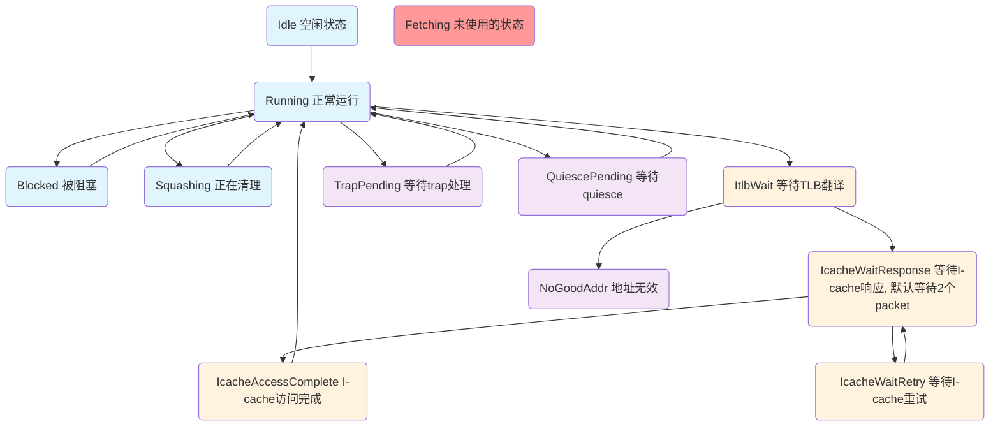

# GEM5 O3 CPU Fetch Stage Analysis (重构版本)

## Overview

The Fetch stage is the first pipeline stage in the GEM5 O3 processor model. It is responsible for fetching instructions from the instruction cache and passing them to the Decode stage. In the XiangShan GEM5 customized version, the Fetch stage implements a decoupled frontend design to align with the XiangShan processor architecture.

**重构状态**: 该文档反映了fetch阶段的重构版本，原有320行的单一fetch函数已被重构为8个模块化函数，代码结构更清晰，专门针对RISC-V架构优化，为后续FDIP和2fetch特性奠定基础。

## Key Interfaces with Other Pipeline Stages

### 1. Time Buffer Interfaces

The Fetch stage communicates with other pipeline stages through a time buffer mechanism, which models the delay in communication between different stages:

```cpp
TimeBuffer<TimeStruct> *timeBuffer;  // Main time buffer for communication

// Wires from other stages to Fetch
TimeBuffer<TimeStruct>::wire fromDecode;   // For stall signals and instruction counts
TimeBuffer<TimeStruct>::wire fromRename;   // For stall signals
TimeBuffer<TimeStruct>::wire fromIEW;      // For stall signals and branch resolution
TimeBuffer<TimeStruct>::wire fromCommit;   // For squash signals and interrupts

// Wire to Decode stage
TimeBuffer<FetchStruct>::wire toDecode;    // For sending fetched instructions
```

### 2. Interface with Decode Stage

The Fetch stage forwards fetched instructions to the Decode stage through the `toDecode` wire:

```cpp
// In tick() method:
// Send instruction packet to decode
if (numInst) {
    toDecode->insts = std::move(insts);
    toDecode->size = numInst;
    wroteToTimeBuffer = true;
}
```

The Decode stage can send stall signals back to Fetch via the `fromDecode` wire:

```cpp
// In checkSignalsAndUpdate() method:
// Check if the decode stage is stalled
if (fromDecode->decodeStall) {
    stalls[tid].decode = true;
}
```

### 3. Interface with Commit Stage

The Commit stage sends several important signals to the Fetch stage:

- **Branch misprediction signals**: Indicate a branch was mispredicted and the pipeline needs to be squashed
- **Interrupt signals**: Indicate an interrupt needs to be processed
- **Drain signals**: For simulation control

```cpp
// In checkSignalsAndUpdate() method:
// Check for squash from commit
if (fromCommit->commitInfo[tid].squash) {
    DPRINTF(Fetch, "[tid:%i] Squashing from commit.\n", tid);
    squash(fromCommit->commitInfo[tid].pc,
           fromCommit->commitInfo[tid].doneSeqNum,
           fromCommit->commitInfo[tid].squashInst, tid);
}

// Check for commit's interrupt signals
if (fromCommit->commitInfo[tid].interruptPending) {
    interruptPending = true;
}
```

### 4. Interface with IEW Stage

The IEW (Issue/Execute/Writeback) stage provides branch resolution feedback to the Fetch stage:

```cpp
// In checkSignalsAndUpdate() method:
// Check for squash from IEW (mispredicted branch)
if (fromIEW->iewInfo[tid].squash) {
    DPRINTF(Fetch, "[tid:%i] Squashing from IEW.\n", tid);
    squash(fromIEW->iewInfo[tid].pc,
           fromIEW->iewInfo[tid].doneSeqNum,
           fromIEW->iewInfo[tid].squashInst, tid);
}
```

### 5. Branch Predictor Interface

The Fetch stage interacts with the branch predictor to determine the next PC to fetch:

```cpp
bool lookupAndUpdateNextPC(const DynInstPtr &inst, PCStateBase &pc) {
    // Access branch predictor and update PC
    bool predicted_taken = getBp()->predict(inst, pc, inst->pcState());
    // ... additional logic ...
    return predicted_taken;
}
```

## Key Data Structures

### 1. Fetch Buffer

The fetch buffer holds raw instruction data fetched from the instruction cache:

```cpp
uint8_t *fetchBuffer[MaxThreads];     // Raw instruction data
Addr fetchBufferPC[MaxThreads];       // PC of first instruction in buffer
bool fetchBufferValid[MaxThreads];    // Whether buffer data is valid
unsigned fetchBufferSize;             // Size of fetch buffer in bytes
Addr fetchBufferMask;                 // Mask to align PC to fetch buffer boundary
```

The fetch buffer works as a temporary storage between the instruction cache and the instruction queue. Instructions are fetched from the instruction cache in cache-line-sized chunks and stored in the fetch buffer.

### 2. Fetch Queue

The fetch queue stores the processed dynamic instructions before they are sent to decode:

```cpp
std::deque<DynInstPtr> fetchQueue[MaxThreads];  // Queue of fetched instructions
unsigned fetchQueueSize;                        // Maximum size of fetch queue
```

### 3. Memory Request Structures

For I-cache access management:

```cpp
RequestPtr memReq[MaxThreads];        // Primary memory request
RequestPtr anotherMemReq[MaxThreads]; // Used for unaligned access
PacketPtr firstPkt[MaxThreads];       // First packet for I-cache access
PacketPtr secondPkt[MaxThreads];      // Second packet for unaligned access
std::pair<Addr, Addr> accessInfo[MaxThreads];  // Address info for cache access
```

### 4. Status Tracking Structures

```cpp
// Overall fetch status
enum FetchStatus { Active, Inactive } _status;

// Per-thread status
enum ThreadStatus {
    Running, Idle, Squashing, Blocked, Fetching, TrapPending,
    QuiescePending, ItlbWait, IcacheWaitResponse, IcacheWaitRetry,
    IcacheAccessComplete, NoGoodAddr, NumFetchStatus
} fetchStatus[MaxThreads];

// Stall tracking
struct Stalls {
    bool decode;
    bool drain;
} stalls[MaxThreads];

// Stall reason tracking
std::vector<StallReason> stallReason;
```

### 5. Branch Prediction Structures

```cpp
branch_prediction::BPredUnit *branchPred;  // Main branch predictor
branch_prediction::stream_pred::DecoupledStreamBPU *dbsp;  // Stream predictor
branch_prediction::ftb_pred::DecoupledBPUWithFTB *dbpftb;  // FTB predictor
branch_prediction::btb_pred::DecoupledBPUWithBTB *dbpbtb;  // BTB predictor
```

### 6. Loop Buffer Structures

```cpp
branch_prediction::ftb_pred::LoopBuffer *loopBuffer;  // Loop buffer
bool enableLoopBuffer;                                // Loop buffer enable flag
unsigned currentLoopIter;                             // Current loop iteration counter
bool currentFetchTargetInLoop;                        // If current fetch is in a loop
```

## Core Function Workflow

### 1. Main Fetch Cycle (tick函数)

基于重构后的代码实现，fetch阶段的主要执行流程如下：

```
tick()
  |
  +--> initializeTickState()  // Initialize state for this tick cycle
        |
        +--> checkSignalsAndUpdate()  // Check signals from other stages for all active threads
        |
        +--> Update fetch status distribution stats
        |
        +--> Reset pipelined fetch flags
  |
  +--> fetchAndProcessInstructions()  // Perform fetch operations and instruction delivery
        |
        +--> fetch()  // Fetch instructions from active threads (loop for numFetchingThreads)
        |     |
        |     +--> selectFetchThread()  // Select thread to fetch from
        |     |
        |     +--> checkDecoupledFrontend()  // Check FTQ availability for decoupled frontend
        |     |
        |     +--> prepareFetchAddress()  // Handle status transitions and address preparation
        |     |
        |     +--> performInstructionFetch()  // Main instruction fetching logic
        |           |
        |           +--> Instruction fetch loop (while numInst < fetchWidth)
        |                 |
        |                 +--> checkMemoryNeeds()  // Check decoder needs and supply bytes
        |                 |
        |                 +--> Inner loop for macroop handling:
        |                       |
        |                       +--> processInstructionDecoding()  // Decode and create DynInst
        |                       |
        |                       +--> handleBranchAndNextPC()  // Branch prediction and PC update
        |                       |
        |                       +--> Handle macroop transitions
        |
        +--> Pass stall reasons to decode stage
        |
        +--> Record instruction fetch statistics
        |
        +--> handleInterrupts()  // Handle interrupt processing (FullSystem)
        |
        +--> sendInstructionsToDecode()  // Send instructions to decode with stall reason updates
  |
  +--> updateBranchPredictors()  // Handle branch prediction updates (BTB/FTB/Stream)
```

### 2. Signal Processing Workflow (checkSignalsAndUpdate函数)

```
checkSignalsAndUpdate()  // For each active thread
  |
  +--> Update per-thread stall statuses
        |
        +--> Process decode block/unblock signals
  |
  +--> Check squash signals from Commit
        |
        +--> Handle branch misprediction squash
        |
        +--> Handle trap squash  
        |
        +--> Handle non-control squash
        |
        +--> Update decoupled branch predictor (BTB/FTB/Stream)
  |
  +--> Process normal commit updates (update branch predictor)
  |
  +--> Check squash signals from Decode
        |
        +--> Handle branch misprediction from decode
        |
        +--> Update decoupled branch predictor
  |
  +--> Check drain stall conditions
  |
  +--> Update fetch status (Blocked -> Running transition)
```

### 3. I-Cache Access Workflow

```
fetchCacheLine()
  |
  +--> Create memory request(s)
  |
  +--> Send request(s) to I-cache
  |
  +--> Wait for response in recvTimingResp()
        |
        +--> Process received data
        |
        +--> Update fetch buffer
        |
        +--> Update fetch status
```

### 4. Branch Prediction Handling (lookupAndUpdateNextPC函数)

```
lookupAndUpdateNextPC()
  |
  +--> Check if using decoupled frontend
        |
        +--> If DecoupledBPUWithBTB: call decoupledPredict()
        |     |
        |     +--> Get prediction and usedUpFetchTargets status
        |     |
        |     +--> Set instruction loop iteration info
        |
        +--> If non-decoupled: call traditional branchPred->predict()
  |
  +--> Handle non-control instructions (advance PC normally)
  |
  +--> Handle control instructions
        |
        +--> Set prediction target and taken status
        |
        +--> Update branch statistics
        |
        +--> Return prediction result
```

### 5. Instruction Building and Queue Management

```
buildInst()
  |
  +--> Get sequence number from CPU
  |
  +--> Create DynInst with static instruction info
  |
  +--> Set thread-specific information
  |
  +--> For decoupled frontend: set FSQ and FTQ IDs
  |
  +--> Add to CPU instruction list
  |
  +--> Add to fetch queue
  |
  +--> Handle delayed commit flags
```

## Decoupled Frontend Implementation

目前主要使用的分支预测器是**DecoupledBPUWithBTB**，这是一个解耦前端设计，将分支预测与指令获取分离：

```cpp
// Check if using decoupled frontend
bool isDecoupledFrontend() { return branchPred->isDecoupled(); }

// Different predictor types (目前主要使用BTB)
bool isStreamPred() { return branchPred->isStream(); }
bool isFTBPred() { return branchPred->isFTB(); }
bool isBTBPred() { return branchPred->isBTB(); }  // 主要使用的预测器类型

// Track if FTQ is empty
bool ftqEmpty() { return isDecoupledFrontend() && usedUpFetchTargets; }
```

### DecoupledBPUWithBTB 工作流程：

1. **初始化**: 在构造函数中检测并初始化BTB预测器
```cpp
if (isBTBPred()) {
    dbpbtb = dynamic_cast<branch_prediction::btb_pred::DecoupledBPUWithBTB*>(branchPred);
    assert(dbpbtb);
    usedUpFetchTargets = true;
    dbpbtb->setCpu(_cpu);
}
```

2. **每周期更新**: 在updateBranchPredictors()中
```cpp
if (isBTBPred()) {
    assert(dbpbtb);
    dbpbtb->tick();
    usedUpFetchTargets = !dbpbtb->trySupplyFetchWithTarget(pc[0]->instAddr(), currentFetchTargetInLoop);
}
```

3. **Fetch Target检查**: 在fetch()函数开始时检查FTQ是否有可用目标
```cpp
if (isBTBPred()) {
    if (!dbpbtb->fetchTargetAvailable()) {
        dbpbtb->addFtqNotValid();
        DPRINTF(Fetch, "Skip fetch when FTQ head is not available\n");
        return;
    }
}
```

4. **分支预测调用**: 在lookupAndUpdateNextPC()中
```cpp
if (isBTBPred()) {
    std::tie(predict_taken, usedUpFetchTargets) =
        dbpbtb->decoupledPredict(
            inst->staticInst, inst->seqNum, next_pc, tid, currentLoopIter);
}
```

5. **Squash处理**: 支持不同类型的squash操作
```cpp
// Control squash (branch misprediction)
dbpbtb->controlSquash(ftqId, fsqId, oldPC, newPC, staticInst, instBytes, taken, seqNum, tid, loopIter, fromCommit);

// Trap squash  
dbpbtb->trapSquash(targetId, streamId, committedPC, newPC, tid, loopIter);

// Non-control squash
dbpbtb->nonControlSquash(targetId, streamId, newPC, 0, tid, loopIter);
```

### 关键特性：

- **Fetch Target Queue (FTQ)**: 存储预测的fetch目标地址
- **Stream Queue (FSQ)**: 管理指令流信息  
- **Loop Iteration Tracking**: 跟踪循环迭代信息
- **Target Availability Check**: 每周期检查是否有可用的fetch目标
- **Preserved Return Address**: 支持函数返回地址的特殊处理

## Key Implementation Details

### 1. Instruction Cache Interface

The Fetch stage has its own port to access the instruction cache:

```cpp
class IcachePort : public RequestPort {
    // Handles timing requests to I-cache
    virtual bool recvTimingResp(PacketPtr pkt);
    
    // Handles retry signals from I-cache
    virtual void recvReqRetry();
};

IcachePort icachePort;
```

### 2. Address Translation Handling

The Fetch stage handles instruction address translation:

```cpp
class FetchTranslation : public BaseMMU::Translation {
    // Called when translation completes
    void finish(const Fault &fault, const RequestPtr &req,
                ThreadContext *tc, BaseMMU::Mode mode);
};

// Event to handle delayed translation results
class FinishTranslationEvent : public Event {
    // Process translation result
    void process();
};

FinishTranslationEvent finishTranslationEvent;
```

### 3. SMT Thread Selection

The Fetch stage has multiple thread selection policies:

```cpp
// Thread selection policies
ThreadID getFetchingThread();  // Main policy selection function
ThreadID roundRobin();         // Round robin policy
ThreadID iqCount();            // Based on instruction queue count
ThreadID lsqCount();           // Based on load/store queue count
ThreadID branchCount();        // Based on branch count
```

## Performance Monitoring and Statistics

```cpp
struct FetchStatGroup : public statistics::Group {
    // Stall statistics
    statistics::Scalar icacheStallCycles;
    statistics::Scalar tlbCycles;
    statistics::Scalar idleCycles;
    statistics::Scalar blockedCycles;
    
    // Instruction statistics
    statistics::Scalar insts;
    statistics::Scalar branches;
    statistics::Scalar predictedBranches;
    
    // Performance metrics
    statistics::Formula idleRate;
    statistics::Formula branchRate;
    statistics::Formula rate;
    
    // Frontend performance metrics
    statistics::Formula frontendBound;
    statistics::Formula frontendLatencyBound;
    statistics::Formula frontendBandwidthBound;
};
```

## XiangShan特有增强

1. **解耦前端设计**: 支持BTB、FTB和Stream-based预测（目前主要使用DecoupledBPUWithBTB）
2. **TAGE, ITTAGE和Loop Predictor**: 与XiangShan对齐的高级分支预测
3. **指令延迟校准**: 时序校准以匹配昆明湖硬件特性
4. **RISC-V特有支持**: 如vsetvl指令的特殊处理

## 高级特性

1. **Loop Buffer**: 缓存循环指令以提高能效
2. **流水线式I-cache访问**: 允许overlapping的多个I-cache访问
3. **Fetch节流控制**: 基于后端压力控制fetch速率
4. **Misaligned Access处理**: 支持跨cache line的指令获取
5. **Intel TopDown性能分析**: 详细的前端性能瓶颈分析


## 详细代码分析

### 关键函数分析

#### tick() - 主循环函数
每个时钟周期执行一次的主要函数，包含三个主要阶段：

1. **initializeTickState()**: 初始化周期状态
   - 重置状态变化标志和时间缓冲写入标志
   - 更新fetch状态统计分布
   - 重置流水线ifetch标志
   - 处理vsetvl等待状态（RISC-V特有）

2. **fetchAndProcessInstructions()**: 执行fetch操作和指令处理
   - 循环处理所有活跃线程的fetch操作
   - 传递stall原因到decode阶段
   - 记录指令fetch统计信息
   - 处理中断（FullSystem模式）
   - 发送指令到decode阶段并测量前端气泡

3. **updateBranchPredictors()**: 更新分支预测器
   - 调用分支预测器的tick()方法
   - 尝试为fetch提供目标地址
   - 更新usedUpFetchTargets状态

#### fetch() - 重构后的指令获取核心函数

重构后的fetch()函数更加模块化，分为四个清晰的阶段：

```cpp
void fetch(bool &status_change) {
    ThreadID tid = selectFetchThread();                    // 线程选择
    if (tid == InvalidThreadID) return;
    
    if (!checkDecoupledFrontend(tid)) return;              // 解耦前端检查
    
    Addr fetch_addr;
    if (!prepareFetchAddress(tid, status_change, fetch_addr)) return;  // 地址准备
    
    performInstructionFetch(tid, fetch_addr, status_change);           // 指令获取
}
```

**各阶段详细说明**：

1. **selectFetchThread()**: 线程选择和基础检查
   - 调用getFetchingThread()选择要fetch的线程
   - 处理无效线程ID的情况
   - 更新线程fetch统计信息

2. **checkDecoupledFrontend()**: 解耦前端检查
   - 检查FTQ(Fetch Target Queue)是否有可用的fetch目标
   - 支持BTB/FTB/Stream三种预测器类型
   - 在FTQ为空时设置相应的stall原因并返回

3. **prepareFetchAddress()**: 地址准备和状态处理
   - 处理IcacheAccessComplete状态转换
   - 检查fetch buffer有效性和中断条件
   - 准备fetch地址，处理cache访问逻辑
   - 管理fetchStatus状态转换

4. **performInstructionFetch()**: 主要指令获取循环
   - 执行主要的指令解码和获取逻辑
   - 管理fetch宽度和队列大小限制
   - 处理分支预测和PC更新

#### performInstructionFetch() - 重构后的指令获取主循环

重构后的performInstructionFetch()函数进一步模块化，包含三个专用子函数：

```cpp
void performInstructionFetch(ThreadID tid, Addr fetch_addr, bool &status_change) {
    // 主循环: 处理直到fetch宽度或其他限制
    while (numInst < fetchWidth && fetchQueue[tid].size() < fetchQueueSize &&
           !predictedBranch && !ftqEmpty() && !waitForVsetvl) {
        
        // 1. 检查内存需求并供给decoder
        stall = checkMemoryNeeds(tid, this_pc, curMacroop);
        if (stall != StallReason::NoStall) break;
        
        // 2. 内层循环: 从缓冲的内存中提取尽可能多的指令
        do {
            instruction = processInstructionDecoding(tid, this_pc, next_pc, 
                                                    staticInst, curMacroop, newMacro);
            handleBranchAndNextPC(instruction, this_pc, next_pc, 
                                 predictedBranch, newMacro);
        } while (curMacroop && limitChecks);
    }
}
```

**子函数功能说明**：

#### checkMemoryNeeds() - 内存需求检查函数
专门处理RISC-V架构的decoder字节供给：

```cpp
StallReason checkMemoryNeeds(ThreadID tid, const PCStateBase &this_pc, 
                           StaticInstPtr &curMacroop) {
    // 1. Macroop处理: 如果是macroop，不需要新的内存字节
    if (curMacroop) return StallReason::NoStall;
    
    // 2. Fetch Buffer检查: 验证buffer有效性和范围
    if (!fetchBufferValid[tid] || PC超出范围) {
        return StallReason::IcacheStall;
    }
    
    // 3. 字节供给: 为RISC-V提供4字节对齐的数据
    memcpy(decoder->moreBytesPtr(), fetchBuffer + offset, 4);
    decoder->moreBytes(this_pc, fetch_pc);
    
    return StallReason::NoStall;
}
```

#### processInstructionDecoding() - 指令解码处理函数
统一处理指令解码和动态指令创建：

```cpp
DynInstPtr processInstructionDecoding(ThreadID tid, PCStateBase &this_pc,
                                     const std::unique_ptr<PCStateBase> &next_pc,
                                     StaticInstPtr &staticInst, 
                                     StaticInstPtr &curMacroop, bool &newMacro) {
    // 1. 指令解码: 普通指令或macroop microops
    if (!curMacroop) {
        staticInst = decoder->decode(this_pc);  // 解码新指令
        if (staticInst->isMacroop()) curMacroop = staticInst;
    } else {
        staticInst = curMacroop->fetchMicroop(this_pc.microPC()); // 获取microop
        newMacro |= staticInst->isLastMicroop();
    }
    
    // 2. 动态指令创建: 调用buildInst()创建DynInst
    DynInstPtr instruction = buildInst(tid, staticInst, curMacroop, this_pc, *next_pc, true);
    
    // 3. RISC-V特殊处理: vector配置指令处理
    if (staticInst->isVectorConfig()) {
        waitForVsetvl = decoder->stall();
    }
    
    return instruction;
}
```

#### handleBranchAndNextPC() - 分支预测和PC更新函数
集中处理分支预测和PC状态管理：

```cpp
void handleBranchAndNextPC(DynInstPtr instruction, PCStateBase &this_pc,
                          std::unique_ptr<PCStateBase> &next_pc,
                          bool &predictedBranch, bool &newMacro) {
    // 1. PC状态准备: 保存当前PC到next_pc
    set(next_pc, this_pc);
    
    // 2. 分支预测: 区分解耦和非解耦前端
    if (!isDecoupledFrontend()) {
        predictedBranch |= this_pc.branching();
    }
    // 对于解耦前端，需要调用lookupAndUpdateNextPC()来更新next_pc，并判断当前pc 是否跳出了当前FTQ，如果跳出了，则需要移动到下一个FTQ
    predictedBranch |= lookupAndUpdateNextPC(instruction, *next_pc);
    
    // 3. Macroop转换检查: 检查是否移动到新macroop
    newMacro |= this_pc.instAddr() != next_pc->instAddr();
    
    // 4. PC更新: 设置下一周期的PC
    set(this_pc, *next_pc);
}
```

#### checkSignalsAndUpdate() - 信号处理函数
处理来自其他流水线阶段的控制信号：

1. **Decode阶段信号**: 处理block/unblock信号
2. **Commit阶段信号**: 
   - 处理squash信号（分支误预测、trap、非控制squash）
   - 更新分支预测器状态
   - 处理中断信号
3. **Decode阶段Squash**: 处理来自decode的分支误预测
4. **状态转换**: 管理Blocked/Running状态转换

### 主要机制特点

#### 1. 多线程支持
- 通过ThreadID区分不同线程状态和操作
- 支持多种线程选择策略（RoundRobin、IQCount、LSQCount等）
- 每个线程独立的fetch状态和缓冲区

#### 2. 流水线控制
- **Stall机制**: 详细的stall原因跟踪和传递
- **流水线式I-cache访问**: 支持overlapping的cache访问
- **状态机管理**: 完整的fetch状态转换逻辑

#### 3. Decoupled Frontend (主要使用BTB)
- **FTQ管理**: Fetch Target Queue提供预测的fetch目标
- **每周期检查**: 确保FTQ有可用目标才进行fetch
- **Loop支持**: 跟踪循环迭代信息和循环内fetch

#### 4. 性能分析支持
- **Intel TopDown方法**: 测量前端气泡（frontend bubbles）
- **详细统计**: 收集各种性能指标和stall原因
- **Frontend Bound分析**: 区分延迟bound和带宽bound

#### 5. Cache和内存管理
- **Fetch Buffer**: 缓存从I-cache获取的指令数据
- **Misaligned Access**: 支持跨cache line的指令获取
- **Memory Request管理**: 处理I-cache访问和TLB翻译

#### 6. 错误处理和恢复
- **Squash操作**: 支持多种类型的pipeline flush
- **Translation Fault**: 处理地址翻译错误
- **Cache Miss**: 处理I-cache miss和retry逻辑

## Fetch状态转移图

当前fetch阶段支持跨越2个cacheline的指令获取(misaligned fetch)，默认每拍都会访问两个cacheline 来获取66Byte 的fetchBuffer.

### 状态转移图


